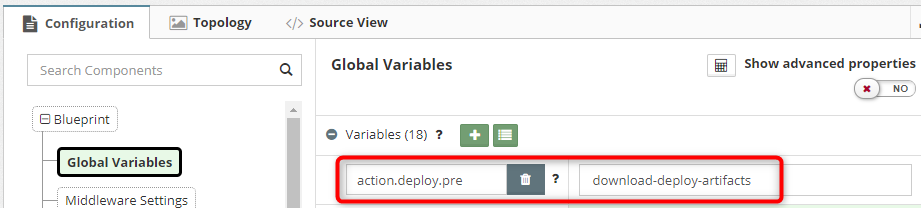

Does MyST support the coping of the KeyStore files, archive binaries or other files into Linux host? Yes, it can be achieved with two options.

## Option 1: System Artifacts

1. Compress the files into ZIP and upload the artifacts to your binary repository (eg. Artifactory).

2. Go to Platform Blueprint > Global Variables
   1. Click **+**
   2. Enter action.deploy.pre=download-deploy-artifacts 
3. Now go to System Artifacts
   1. Click **+**
   2. Enter the name and click **OK**
4. Select the type as **Application Configuration (Properties/XML file etc)**
5. Enter artifact details and Maven coordinates
6. Add the [metadata properties](https://docs.rubiconred.com/myst-studio/appendix/artifact/#application-configuration-propertiesxml). Below is an example 
7. Go to Platform Model > Actions
   1. Run **Update** action which brings the platform instance to the revision containing the artifact details
8. Go to Platform Model > Actions
   1. Click **Control** option then select **Custom**.
9. Run **deploy** action 
##### Note: Artifacts will be deployed as part of provisioning or re-provisioning

## Option 2: Release Pipeline

This is effectively the same as Option 1 but instead of configuring a Platform Blueprint you configure a Release Pipeline.

1. Compress the files into ZIP and upload the artifacts to your binary repository (eg. Artifactory).
2. Register as third party artifact.
   1. Click **Release Management** > **Artifacts** > **Discover** > **Register Third Party Artifacts**
   2. Enter artifact details and Maven coordinates
   3. Add the [metadata properties](https://docs.rubiconred.com/myst-studio/appendix/artifact/#application-configuration-propertiesxml) as shown below  
3. Create the **Application Blueprint** and add the artifact 

4. Create the **[Release Pipeline](https://docs.rubiconred.com/myst-studio/release/pipeline/)** and deploy the artifact 
