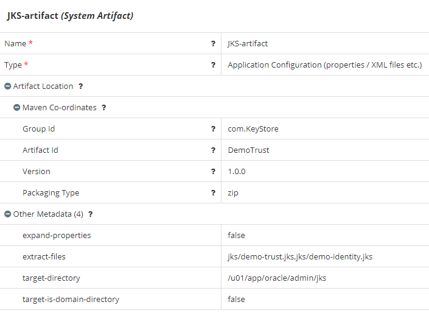
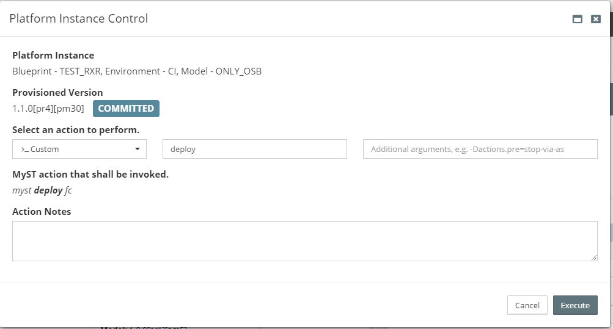
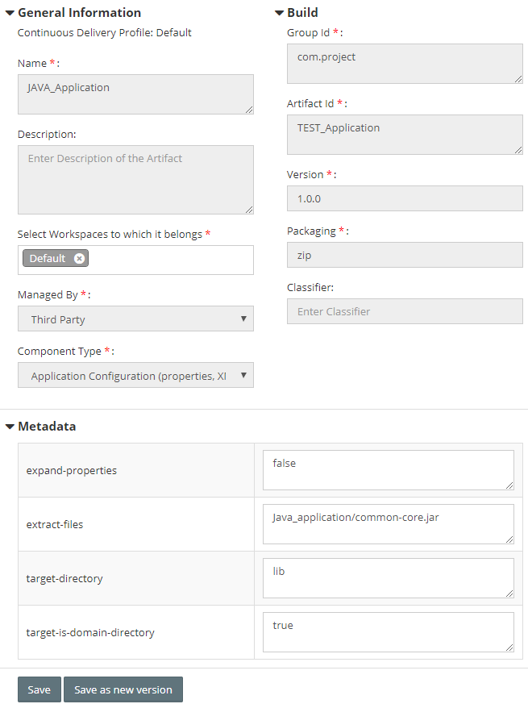
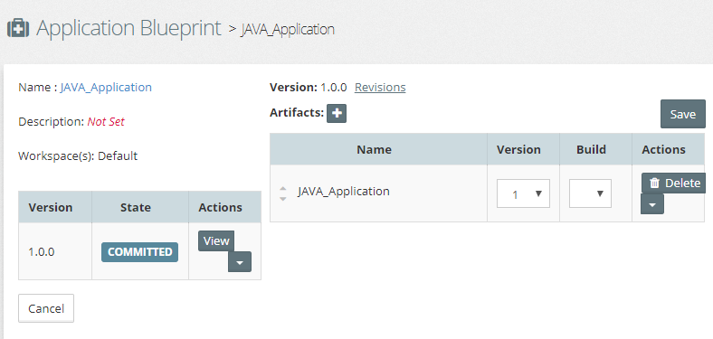
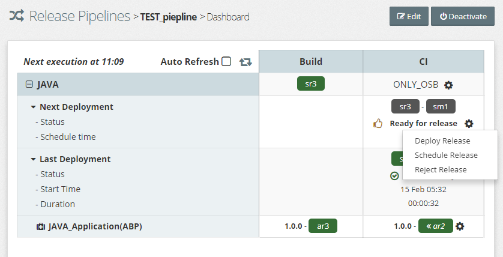

Does MyST support the coping of the KeyStore files, archive binaries or other files into Linux host? Yes, it can be achieved with two options.

### Option 1: System Artifacts

1. Compress the files into ZIP and upload the artifacts to your binary repository (eg. Artifactory).

2. Go to Platform Blueprints > System Artifacts

   1. Click **+**
   2. Enter the name and click **OK**

3. Select the type as **Application Configuration (Properties/XML file etc)**

4. Enter artifact details and Maven coordinates

5. Add the [metadata properties](https://docs.rubiconred.com/myst-studio/appendix/artifact/#application-configuration-propertiesxml) as shown below  

   

   

   | **Property**               | Value                                      |
   | -------------------------- | ------------------------------------------ |
   | expand-properties          | false                                      |
   | extract-files              | jks/demo-trust.jks , jks/demo-identity.jks |
   | target-directory           | /u01/app/oracle/admin/jks                  |
   | target-is-domain-directory | No                                         |

6. Go to Platform Model > Actions

   1. Run **Update** action which brings the platform instance to the revision containing the artifact details

7. Go to Platform Model > Actions

   1. Click **Control** option then select **Custom**.

8. Run **deploy** action 

   

   

##### Note: Artifacts will be deployed as part of provisioning or re-provisioning

### Option 2: Release Pipeline

This is effectively the same as Option 1 but instead of configuring a Platform Blueprint you configure a Release Pipeline.

1. Compress the files into ZIP and upload the artifacts to your binary repository (eg. Artifactory).

2. Register as third party artifact.

   1. Click **Release Management** > **Discover** > **Register Third Party Artifacts**

   2. Enter artifact details and Maven coordinates

      

      

   3. Add the [metadata properties](https://docs.rubiconred.com/myst-studio/appendix/artifact/#application-configuration-propertiesxml) as shown below  

      | **Property**               | Value                            |
      | -------------------------- | -------------------------------- |
      | expand-properties          | false                            |
      | extract-files              | Java_application/common-core.jar |
      | target-directory           | lib                              |
      | target-is-domain-directory | yes                              |

3. Create the **Application Blueprint** and add the artifact 

   

   

4. Create the **[Release Pipeline](https://docs.rubiconred.com/myst-studio/release/pipeline/)** and deploy the artifact 

​      

