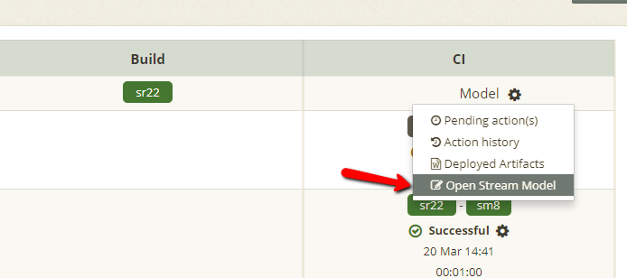

When developing Oracle Service Bus (OSB) services there are scenarios where OSB customization files cannot be used but you require environment specific customizations. This article extends the [MyST Configuration Plans](https://help.mystsoftware.com/deployments/osb-change-transport-details#myst-configuration-plan) documentation to give examples of how to:

1. Change 'HTTPS required' from 'false' to 'true'
2. Change 'Authentication' from 'None' to 'Client Certificate'
3. Attach or detach an OWSM Policy


### Prerequisites

* MyST Studio release pipelines have been setup
* Artifact builds are publishing to MyST Studio via the MyST Jenkins Plugin or MyST Transport JAR

### OSB Project

Create an OSB project which contains code for 'HTTPS required', 'Authentication', and 'OWSM Policy'. This ensures the code is created because default options are generally not included in the code.

1. 'HTTPS required' and 'Authentication'<br>
2. 'OWSM Policy'<br>

### Maven POM

A myst configuration plan must be used. You can define the myst configuration plan in `pom.xml`:

```xml
<properties>
      <myst-config-plan-location>(EMBEDDED)/myst-config-plan.xml</myst-config-plan-location>
</properties>
```

### MyST Configuration Plan

Create a MyST Configuration Plan as follows. Take note of the following elements:

* `include` is a wildcard of files processed by the myst config plan
* `fileset` is file in which myst applies the myst config plan
* `replace` is a property variable which can be customized per environment in the Stream Model


```xml
<tns:configplan xmlns:tns="http://myst.rubiconred.com/configplan">
  <update-list>
    <update>
        <fileset>
            <include name="**/*.stock.*.ProxyService"/>
        </fileset>
        <search-replace-list>
          <search-replace>
          <xpath>/proxyServiceEntry/endpointConfig/provider-specific/inbound-properties/use-https</xpath>
          <replace>${ProxyUseHTTPS}</replace>
          <action-on-not-found>warn</action-on-not-found>
        </search-replace>
        <search-replace>
          <xpath>/proxyServiceEntry/endpointConfig/provider-specific/inbound-properties/client-authentication</xpath>
          <replace>${ProxyClientAuth}</replace>
          <action-on-not-found>warn</action-on-not-found>
        </search-replace>
        <search-replace>
        <xpath>proxyServiceEntry/coreEntry/ws-policy/binding-mode</xpath>
          <replace>${ProxyBindingMode}</replace>
          <action-on-not-found>warn</action-on-not-found>
        </search-replace>
      </search-replace-list>
    </update>
  </update-list>
</tns:configplan>
```

### Preparing your Deployment

#### Artifact Property Registry

After building the application you should see the property variables in the Artifact Property Registry.

1. Go to Release Management > Artifact Property Registry
2. Click Edit<br>
3. Define the defaults normally used for non-production as seen below.
4. Click Save

*NOTE: The _\_REMOVE\__ value tells MyST to remove the node from the OSB code. When setting 'HTTPS required' to false you do not need the 'Authentication' code.*

#### Stream Model

Here you can define the property variable.

1. Go to Release Pipeline > YOUR_PIPELINE
2. Click the cog for the Platform Model
3. Select Open Stream Model<br>


For **non-production** environments you can use the default values by typing or pressing the default values icon.


For **production** environments you will use the opposite values. ProxyClientAuth needs to be empty so MyST does not make any changes.


#### Deployment

Lastly the artifact can be deployed.

1. Click the cog then click Deploy Release and to see a deployment summary<br>
2. Click Deploy<br>

### Troubleshooting

In case of issues you can look at the logs to see how the myst config plan was applied.

```
 Importing /tmp/mystWorkspace/e0e2051a-d12a-41a5-a60b-6c8c6dd5e8a5/target/artifacts/com.rubiconred.osb/Stock-1.0-31.sbar
 Applying the MyST configuration plan to the application
 Trying to apply configuration plan '(EMBEDDED)/myst-config-plan.XML' to the source '/tmp/mystWorkspace/e0e2051a-d12a-41a5-a60b-6c8c6dd5e8a5/tmp/03-20-18-00-50-22-25621/d44cbafe-a88a-4478-956b-2622984bb9cd/Stock-1.0-31.sbar'
 Parsing the plan contents
 Removing the embedded plan file so that it does not get included in the final output
 Expanding the entire resource hierarchy based on the plan
 Performing the substitutions now
 Resource - Stock-1.0-31.sbar
 Resource - Stock/Stock_1.0/Stock_1.0.ProxyService
 Packing the contents back into an archive if required
 Plan execution complete. Preparing the execution summary
 Resource - Stock-1.0-31.sbar
  Status SUCCESS
  Number of sub-resources matched - 1
    Resource - Stock/stock_1.0/stock_1.0.ProxyService
     Status SUCCESS
     Substitution count, Total - 3, Successful - 3, Failure - 0, No matches - 0, Skipped - 0
 The application binary after applying the plan is located at /tmp/mystWorkspace/e0e2051a-d12a-41a5-a60b-6c8c6dd5e8a5/tmp/03-20-18-00-50-22-25621/d44cbafe-a88a-4478-956b-2622984bb9cd/Stock-1.0-31.sbar

```

The logs of interest are:

* `Trying to apply configuration plan` indicates the myst config plan is attempting to be applied
* `Number of sub-resources matched - 1` indicates one file has been found to apply the myst config plan.
* `Substitution count, Total - 3, Successful - 3` indicates our 3 (out of 3) myst config plan searches and replaces were successful


