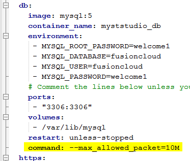

You may find a MyST Studio action fails in the UI backend however, the MyST agent continues and completes successfully. This is due to MyST Studio failing to push the `studio.log` into its database because of a max packet constraint.

The default MySQL max_allowed_packet is ~4MB. If studio.log exceeds this size then the MyST Studio action fails but the MyST agent continues to run normally.

## Error Message
In the container logs you will find the following error. Take note of the error:
``Packet for query is too large (6472818 > 4194304). You can change this value on the server by setting the max_allowed_packet' variable.``
```
2018-08-24 04:44:18 WARN  SqlExceptionHelper:144 - SQL Error: 0, SQLState: S1000
2018-08-24 04:44:18 ERROR SqlExceptionHelper:146 - Packet for query is too large (6472818 > 4194304). You can change this value on the server by setting the max_allowed_packet' variable.
2018-08-24 04:44:18 ERROR BatchingBatch:141 - HHH000315: Exception executing batch [could not execute batch]
2018-08-24 04:44:18,322 [0d-0611562d8749] INFO  c.r.f.m.r.AgentInvoker         -
2018-08-24 04:44:18,335 [0d-0611562d8749] ERROR c.r.f.p.c.p.s.InvokeMyST       - Error
org.springframework.orm.jpa.JpaSystemException: could not execute batch; nested exception is org.hibernate.exception.GenericJDBCException: could not execute batch
        at org.springframework.orm.jpa.vendor.HibernateJpaDialect.convertHibernateAccessException(HibernateJpaDialect.java:310) ~[spring-orm-4.2.0.RELEASE.jar:4.2.0.RELEASE]
        at org.springframework.orm.jpa.vendor.HibernateJpaDialect.translateExceptionIfPossible(HibernateJpaDialect.java:221) ~[spring-orm-4.2.0.RELEASE.jar:4.2.0.RELEASE]
        at org.springframework.orm.jpa.JpaTransactionManager.doCommit(JpaTransactionManager.java:521) ~[spring-orm-4.2.0.RELEASE.jar:4.2.0.RELEASE]
        <REMOVED_CLUTTER>
Caused by: java.sql.BatchUpdateException: Packet for query is too large (6472818 > 4194304). You can change this value on the server by setting the max_allowed_packet' variable.
        at com.mysql.jdbc.PreparedStatement.executeBatchSerially(PreparedStatement.java:1819) ~[mysql-connector-java-5.1.35.jar:5.1.35]
        <REMOVED_CLUTTER>
2018-08-24 04:44:18,364 [0d-0611562d8749] INFO  ea-af9b-482b-8a0d-0611562d8749 - Finished executing action - id: d51b1816-0703-4cb0-894b-8b87b122c6c8, type - CUSTOM_ACTION
```

## Solution
Increase the `max_allowed_packet` for MyST Studio database container by adding the following. In this example **10M** is used.

1. Backup your MyST Studio database
  `cd /opt/myst-studio/bin`
  `./backup-database.sh`
1. Update `/opt/myst-studio/conf/docker-compose.yml`. The resulting file could look like this:
  
1. Restart MyST Studio
  `cd /opt/myst-studio/bin`
  `./restart.sh`

#### Impact of Increasing  max_allowed_packet
The larger the studio.log file is the slower MyST UI will be to display the log. Raise a [support ticket](https://support.mystsoftware.com) if you find logs you believe should be changed or silent.
