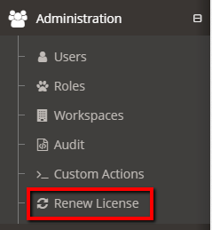

# Installing the License
For new installations of MyST Studio follow the instructions in the MyST Installation Guide:
https://userguide.mystsoftware.com/installation/myst-studio/

# Updating the License
## MyST Studio
1. Run the `backup-database.sh` script to backup your MyST Studio database allowing you to easily rollback.
2. Log into MyST Studio
3. Administration > Renew License 
4. Select the license file (tar.gz) provided by Rubicon Red
5. Log off then log on
6. In the bottom left are your new license details
7. Extract the license file (MyST.lic) to `/opt/myst-studio/conf/data/license/` which ensures if the container is rebuilt the new license file is loaded.

## PRE-5.6.5
It is recommended to upgrade to the latest version of MyST Studio to apply the license. If you have questions please contact [MyST Support](https://support.mystsoftware.com).

## MyST CLI
1. Follow the [MyST CLI license instructions](https://userguide.mystsoftware.com/installation/myst-studio/) for either an automatic or manual installation

**NOTE:** If you have followed the instructions above be aware MyST will continue to display the old license until it expires. Once expired MyST will automatically apply the new license on the next action.

## What about the MyST.lic file I used to receive?
When renewing your license, you will recieve a `MyST-<name>-.lic.tar.gz` file which comes bundled with the license (`MyST.lic`) and an API key (`api.key`).

**NOTE:** If your version of MyST only requires `MyST.lic` you can simply extract the license file from `MyST-<name>.lic.tar.gz`.

## License Expired or Expiring?
If your license is due to expire and you are yet to receive the license please contact [MyST Support](https://support.mystsoftware.com).
