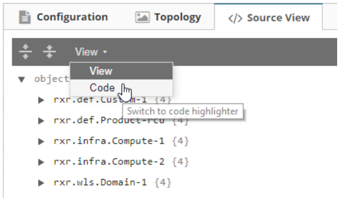
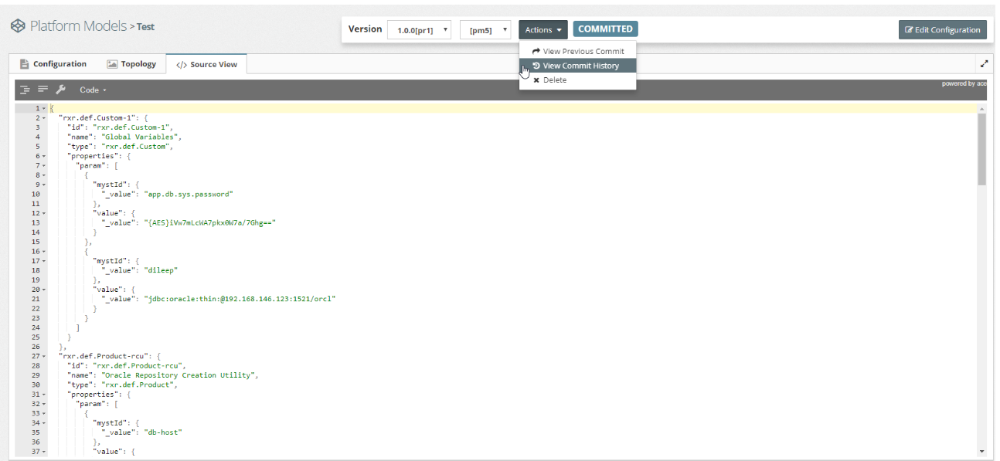
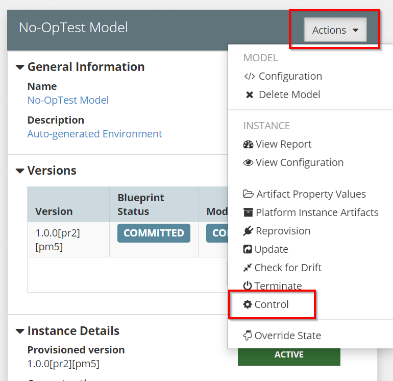
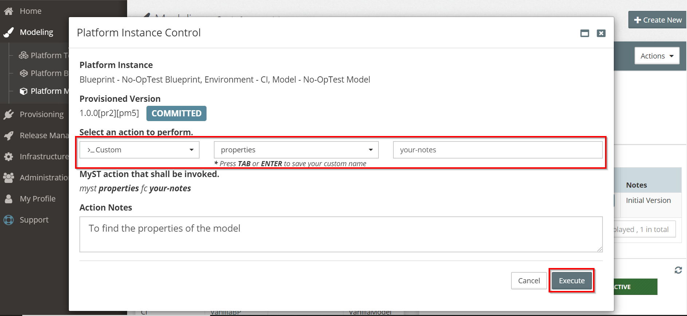
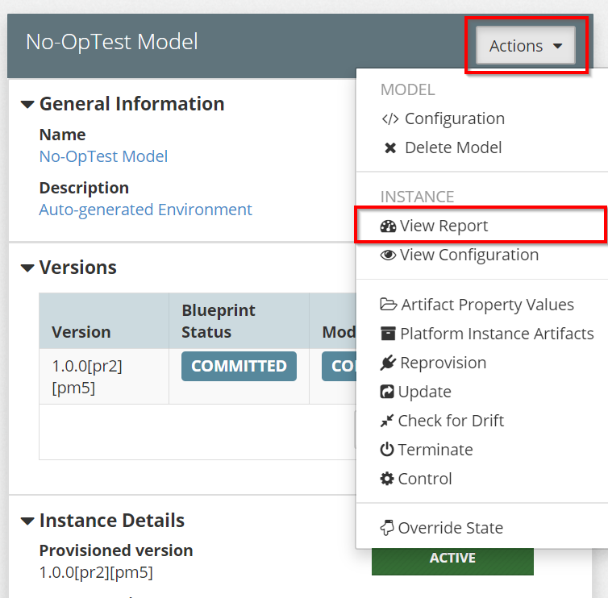
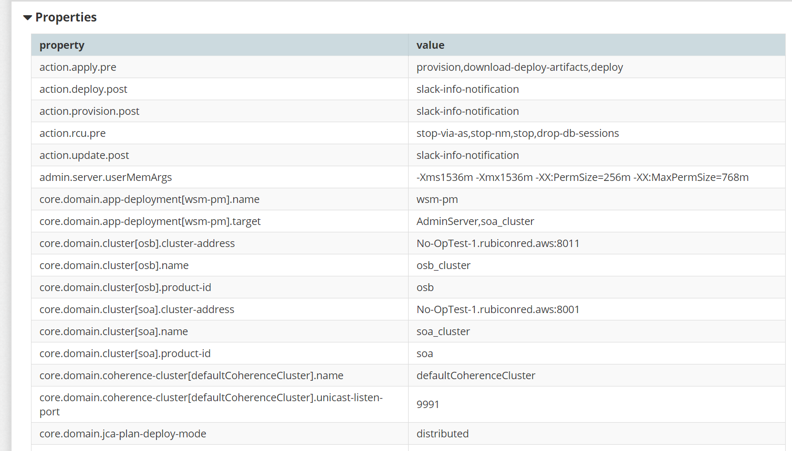
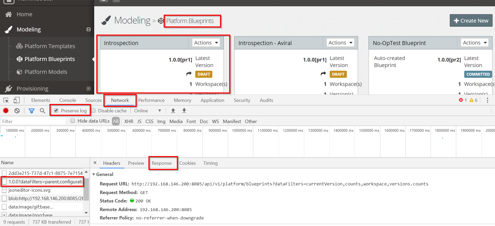
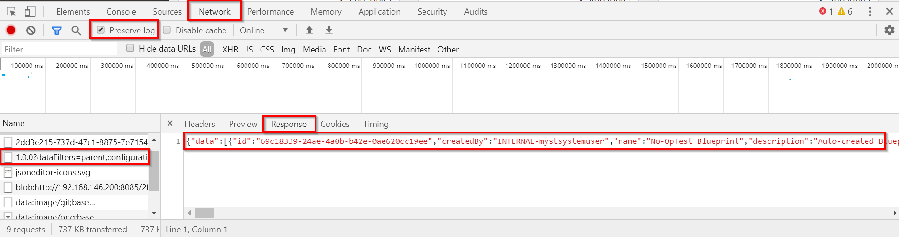
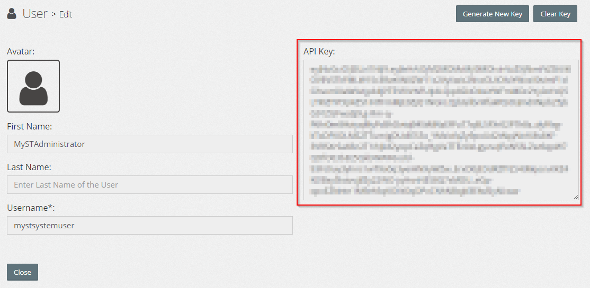

## How to compare changes between two versions of a Platform Model

#### **Using Source Code :**

MyST does not have a functionality to list the changes between two versions of a Platform Model or the Blueprints. While our Engineering team is working on the feature, we have a workaround in place.

Note :- This workaround is available for versions of MyST later than 6.0.0


1. Navigate to Platform Model -> Actions -> Configuration and change the tab to **Source View.**

2. Select the **View** drop-down and change it to **Code.**



3. Navigate to Actions -> View Commit History and get the json payload for the pm versions, you wish to compare.



Use JSON compare tools to find the differences between the different versions of Platform Models. 


**Using MyST 'properties' action:**

MyST 'properties' action gives you a complete report of all the properties, parameters and configurations of the model. We need to run the 'properties' action in the model as a custom-action. Below is the process to view the properties of a sample model.

1. In the model, navigate to **Actions > Control**




2. Select the action as 'Custom', and enter '**properties**' as the custom name, and execute the action.




4. Once the custom-action has run successfully., navigate to **Actions > View Report** to view the custom-action generated report of the model.




5. You can compare the below properties from the **View Report,** with your other model by extracting it's properties in the same way.




#### Using REST API Payload:

Source code of a Blueprint can be obtained by using the REST APIs, which can be used to compare the Blueprints in MyST. From the browser, you can get the Payload, which can then be compared with other Blueprint files.

1. Login to MyST Studio and press F12.

   Once the browser tools are being displayed, navigate to **Network** and enable the **Preserve log**  by checking the box.

2. Once enabled, navigate to your desired Blueprint and browse to its configuration.

   You'll now see that a **log** with a name 'data' is being generated. Click on it to view the source code.

3. After you click on the data **log**, navigate to **Response** tab to view the source code of the Blueprint.




4. Click on **Response** tab, and the source code of the Blueprint displays as follows...



Retrieve the code and use JSON compare tools(example: Beyond Compare) to compare your Blueprints.


## Platform Blueprint Source code retrieving in CLI:

Another way of comparing the Blueprints is by retrieving the Platform Blueprint source code from the CLI.

MyST Studio is built on top of a set of REST APIs meaning any operations performed by the UI can also be automated using the REST APIs. You need to retrieve your API Key, set your environments, to get the Blueprint list and their IDs.

In this example, we are showing how to update a Platform Blueprint using the REST API. At a minimum you will require `curl` to be installed on your machine. To make JSON manipulation easier, it is also recommended to install `jq` which is downloadable from [here](https://stedolan.github.io/jq/download/).

#### Retrieving your API key:

In order to interact with API, you will first need to retrieve and/or regenerate an API key from MyST Studio. This can be performed as follows:  

1. Login to MyST Studio with an administrator account  
2. Click on "Administration" then select "Users"  
3. Under the MySTAdministrator \(API User\) click on drop-down and select "Show API Key"  
     
4. Copy the key, we will use this later in our MyST workspace. If you want, you can generate a new key at any time.  
   

## Setting up your environment

The below `curl` examples will assume the following are set as environment variables

- `MYST_TOKEN=<your api key>`
- `MYST_HOST=<your MyST host>`
- `BLUEPRINT_ID=<your blueprint id>`
- `BLUEPRINT_VERSION=<your blueprint version>`

**NOTE:** The `BLUEPRINT_ID` and `BLUEPRINT_VERSION` can easily be found in your browser URL when selecting the Platform Blueprint.

#### Getting a list of available Blueprints

`curl -k -X GET -H "Authorization: Bearer $MYST_TOKEN"  "https://$MYST_HOST/api/v1/platform/blueprints"`

To pretty print the JSON result, you should consider piping that to `jq` as follows:

`curl -k -X GET -H "Authorization: Bearer $MYST_TOKEN"  "https://$MYST_HOST/api/v1/platform/blueprints" | jq`

#### Getting the ID of a specific Platform Blueprint

The `id` of a given Blueprint can be discovered within the listing of Platform Blueprints at `.data.id`. For instance, in the snippet below the `id` of `SOA Blueprint` is `c2a9a9c6-4dd6-44b4-8b7a-54a14a235802`.

```
{
  "data": [
    {
      "id": "c2a9a9c6-4dd6-44b4-8b7a-54a14a235802",
      "name": "SOA Blueprint",
      ...
```

If you want to programmatically find the id for `SOA Blueprint` you could execute the following with `curl` and `jq`

```
ID=$(curl -k -X GET -H "Authorization: Bearer $MYST_TOKEN"  "https://$MYST_HOST/api/v1/platform/blueprints" | jq --arg NAME "SOA Blueprint" -r ".data[] | select(.name == \$NAME) | .id")
```

Now you can execute `echo $ID` and it will output the Blueprint ID. For example:

`c2a9a9c6-4dd6-44b4-8b7a-54a14a235802`

#### Download the source file for a given Platform Blueprint:

In the previous step, we should how to get the identifier for a platform blueprint and set that to an environment variable called `ID`.

Now, we are going to download that source to a file called `blueprint.json` for `1.0.0` of our platform blueprint.

```
curl -k -X GET -H "Authorization: Bearer $MYST_TOKEN"  "https://$MYST_HOST/api/v1/platform/blueprints/$ID/versions/1.0.0?suppressComputed=true&dataFilters=*" > blueprint.json
```

**Note:** If you're blueprint is on a different version to 1.0.0, make sure you change that in your query.

If you wish to retrieve a specific revision of a platform blueprint version, you can add %5B**pr23**%5D to the url as shown below. This will retrieve revision 23 of the platform blueprint version 1.0.0.

**Note:** when accessing a specific revision of  a platform blueprint version, the curl url needs to use `http` with the appropriate port instead of using `https`

```
curl -X GET -H "Authorization: Bearer $MYST_TOKEN"  "http://$MYST_HOST:8085/api/v1/platform/blueprints/$ID/versions/1.0.0%5Bpr23%5D?suppressComputed=true&dataFilters=*" > blueprint.json
```

#### Making the code fit from data element:

If you want to change the previously downloaded Blueprint you need to first extract the contents from the `data` element and create a new file.

For example,

```
{
  "data": {
    {
       "id": "c2a9a9c6-4dd6-44b4-8b7a-54a14a235802",
       "name": "SOA Blueprint",
       ...
```

should look like

```
{
    "id": "c2a9a9c6-4dd6-44b4-8b7a-54a14a235802",
    "name": "SOA Blueprint",
   ...
```

If you wanted to automatically update the Blueprint to conform to this, you could run the following in `jq` to create a `new-blueprint.json` file from `blueprint.json`

```
jq .data < blueprint.json > new-blueprint.json
```

Now that you have a `new-blueprint.json` which is in a format that can be pushed to MyST, you can update the contents as you see fit.


## Retrieving the Platform Model

The steps to retrieve the platform model source are the same as those for the platform blueprint. Simply change the url to use `models` instead of `blueprints`, and update the version and revision numbers to their appropriate value e.g. `1.0.0-1`and `%5Bpm23%5D`

```
curl -X GET -H "Authorization: Bearer $MYST_TOKEN"  "http://$MYST_HOST:8085/api/v1/platform/models/$ID/versions/1.0.0-1%5Bpm23%5D?suppressComputed=true&dataFilters=parent,configuration,revisionNumber" > model.json
```

Use JSON Compare tools to find the difference between different versions of the Platform Models and Platform Blueprints.