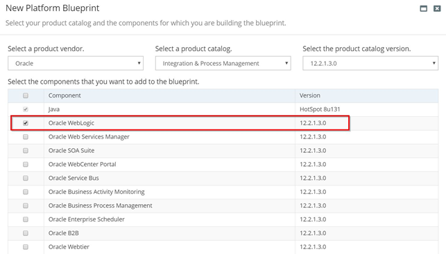
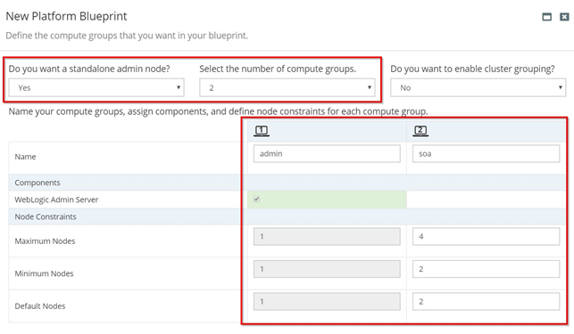
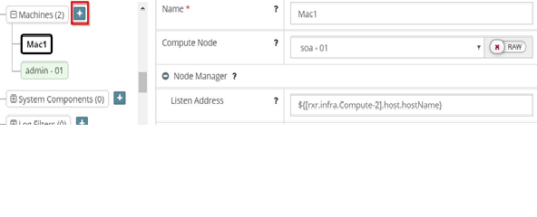
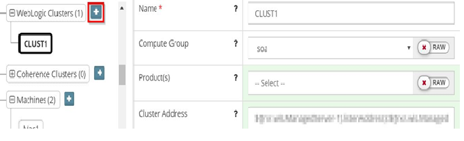

This documents provides steps to provision a vanilla WebLogic Domain of Managed Servers with no other products.

# Create the Platform Blueprint

1. Create a new Platform Blueprint
2. Select only **Oracle WebLogic** as a product
3. Click **Next**  
   
4. Enter the **nodes** as per your requirement
5. Click **Next**  
   
6. Follow the remaining steps in the wizard and click **Finish**
7. You will now have a Platform Blueprint with a vanilla WebLogic domain

# Create the Platform Model

We previously created a Platform Blueprint with a vanilla WebLogic domain. We now need to create the Platform Model and provision it.

## Add a New Machine

1. Go to the Platform Model  > WebLogic Domain Configuration > **Machines**
2. Click Edit Configuration
3. Click on the '**+**' icon to add a new machine
4. Provide name, compute node & listen address  
   
5. Click **Save**

## Adding a New Cluster

1. Go to the Platform Model  > WebLogic Domain Configuration > **WebLogic Clusters**
2. Click Edit configuration, Click on '**+**' to add a new cluster
3. Provide name, compute group & cluster address of the cluster
4. Do not select any **Product(s)**  
   
5. Once you create a Cluster with the above details, you’ll be able to see a **Managed Server** created in the Weblogic Domain Configuration
6. Update the **Managed Server** as required
7. **Save and Commit** the Platform Model
8. You are now ready to Provision

*NOTE: Do not add Machines or Clusters in the Platform Blueprint. As instructed, this has to be done in the Platform Model*

