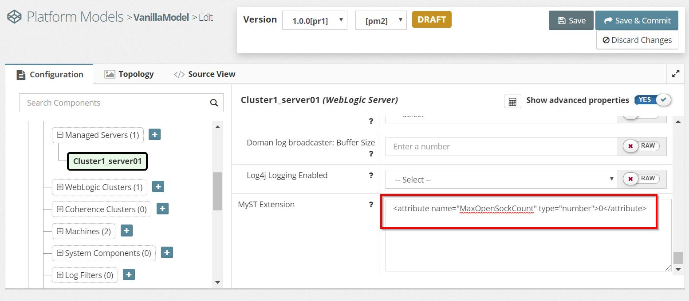

Myst supports the ability to remove resources known to Myst.

# Removing WebLogic Resources Configured in Myst

You can remove a resource by adding a MyST Extension attribute to the resource.

For example, if you want Myst to delete the JDBC DataSource called Stock Trader.

1. Go to JDBC Data Sources > **StockTrader**
2. Click **Show advanced properties**
3. Scroll down to **MyST Extension** and add the attribute  
  ```xml
<attribute name="_present">0</attribute>
  ```
  
4. Click **Save and Commit**
5. Running a Myst 'update' action will now delete the DataSource
