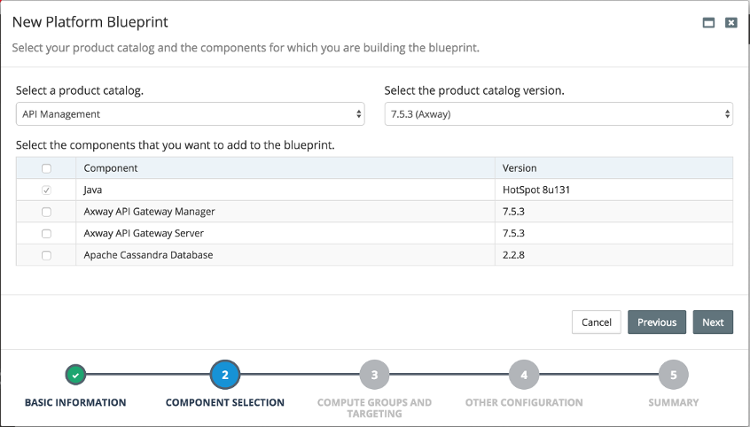
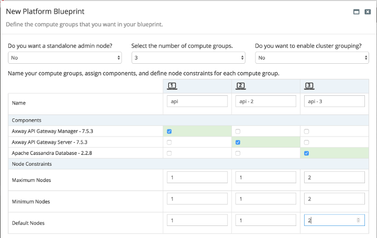

# Axway Product Catalog

Axway support is provided by the following three products, all defined within the  API Management product catalog

| Component | Description |
| --------- | ----------- |
| Apache Cassandra Database | Choosing this option will support the creation of Cassandra database instances, including multiple node clusters. Apache Cassandra support has been implemented to support API Gateway environments, however it is also possible to create standalone Cassandra DB environments. |
| Axway API Gateway Manager | Single administrative gateway instance in an API Manager configuration. |
| Axway API Gateway Server | A single API Gateway instance. This product is required when using the API Gateway Manager product, and is also used to define core configuration properties for the API Gateway product as a whole. |

# Assumptions

The implementation of Axway support assumes the use of certificate configuration.
All properties required by products within MyST Studio must be specified explicitly. It is not currently possible to establish a cassandra database without all certificate/keystore parameters defined and the related items pre-existing on the hosts.

# Creating an Axway Environment

A single MyST blueprint and model can be used to create an Axway API Gateway environment including an API Manager node, multiple API Gateway nodes, and a Cassandra database cluster. For each product being used, a single compute group should be defined to control the targeting of specific products.

Note that the compute node targeted for Cassandra DB use has 2 nodes in the above image to support a 2 node cluster.

Required product configuration parameters are detailed below. Once a model has been fully configured for all required products, performing a Provision within MyST Studio will deliver everything required to create an environment across all nodes through automation.

## Product Configuration Parameters

This section provides an example configuration for each supported product, listing all required properties for configuration.

### Axway API Gateway Server

| Name	| Example Value	| Explanation |
| ----- | --------------| --------- |
| `api-manager-hosts`	| `ip-192-168-146-224.us-west-2.compute.internal` |	Comma-separated list of fully-qualified domain names for hosts where API Manager will be configured  |
| `certificate-folder` | `/u01/communal/certificates/NonProd/Internal/Servers/esidev` | Directory to find certificate files in |
| `license-path` | `/home/oracle/Axway.lic` |	Full path to license file on each node configured for API Gateway. This property is also used by API Gateway Manager. |
| `os-group` | `oinstall` |	OS group to use when creating product installation |
| `os-user` | `oracle` |	OS user to use when creating product installation |
| `python-path` | `/usr/local/bin/python2.7` |	Full path to Python 2.7 (or above) binary on each node configured for API Gateway. This property is also used by API Gateway Manager, and in a model containing both API Gateway Server and Cassandra DB, can be used by Cassandra DB.  |
| `service-pack-file` | `	APIGateway_7.5.3_SP6_Core_linux-x86-64_BN2018032339.tar.gz` |	Name of Axway API Gateway service pack file to install as part of patching product installation. This file will be found under the directory indicated by the install.dir MyST global variable. |

#### Multiple Axway Gateway Server Groups

To specify the respective Gateway group for each node in a configuration with Axway Gateway Server targeted to it, specify a global variable with the following syntax:

`<fqdn>.group=<Group Name>`

For example:

`ip-192-168-146-231.us-west-2.compute.internal.group=Internal`

Each server with an Axway Gateway requires this parameter to be set. Currently MyST Studio will also auto-generate a recommended parameter for each relevant server using the IP address of the server. This variable will not be used during configuration, but should be set to the same group name. This duplication will be removed in the next release of MyST Studio.

### Axway API Gateway Manager

| Name	| Example Value	| Explanation |
| ----- | --------------| --------- |
| `admin-host` | `192.168.146.222` | IP address/host API Manager is configured on |
| `admin-password` | `welcome1` | Password used to authenticate for administration functions |
| `admin-port` | `8090` | Port used for administration traffic |
| `certificate-folder` | `/u01/communal/certificates/NonProd/Internal/Servers/esiadmin` | Directory to find certificate files in |
| `certificate-cer-file` | `<full path to file>` | Certificate file for admin gateway to use in certificate store (.cer file) |
| `certificate-issuing-file` | `<full path to file>` | Issuing authority certificate to use as part of certificate store (.cer file) |
| `certificate-root-file` | `<full path to file>` | Root certificate to use as part of certificate store (.cer file) |
| `groups` | `Internal,External` | Comma-separated list of all defined groups in API Manager instance |
| `management-address` | `192.186.146.222` | IP address/host used for management traffic |
| `os-group` | `oinstall` | OS group to use when creating product installation |
| `os-user` | `oracle` | OS user to use when creating product installation |
| `site-port` | `8095` | Port to use for gateway traffic |

### Apache Cassandra Database

Given the length of values for Cassandra Database parameters, explanations are not provided in the table below.

| Name	| Example Value	|
| ----- | --------------|
| `cluster-addresses` | 192.168.146.150,192.168.146.171 |
| `cqlrshrc-cert-file` | `/u01/share/dev.pem` |
| `cqlrshrc-key-file` | `/u01/share/dev.key` |
| `datacenter-name` | `GatewayDatacenter` (default value) |
| `listen-port` | `9042` (default value) |
| `python-path` | `/usr/local/bin/python2.7` |
| `rack-name` | `GatewayRack` (default value)  |
| `replication-factor` | `2` |
| `require-client-auth` | `true` (default value) |
| `ssl-algorithm` | `SunX509`  (default value) |
| `ssl-cipher-suites` | `TLS_RAS_WITH_AES_128_CBC_SHA,TLS_RSA_WITH_AES_256_CBC_SHA...`  (default value) |
| `ssl-enabled` | `true`  (default value) |
| `ssl-internode-encryption` | `all`  (default value) |
| `ssl-keystore-file` | `/u01/share/dev.jks` |
| `ssl-protocol` | `TLS`  (default value) |
| `ssl-store-type` | `JKS`  (default value) |
| `ssl-truststore-file` | `/u01/share/truststore.jks` |
| `ssl-truststore-password` | `welcome1` |
| `user` | `oracle` |

# Troubleshooting Axway Provisioning

Provisioning Axway environments can be complicated, particularly when determining why provisioning might have failed, in a configuration that can span multiple nodes. To assist with troubleshooting, especially in the early stages of the lifecycle of Axway support within MyST, a number of log files are created capturing output from particular steps in provisioning. These files exist in the temporary workspaces created by the MyST agent, and should be captured in a generated support artifact.

| File | Information |
| ---- | ------------|
| `configure-admin.log` | Contains output from installation, patching and configuration of an Axway Admin Gateway node. Created by the Python script `configure-axway-admin-python.py` |
| `configure-axway.log` | Contains output from installation, patching and configuration of an Axway Gateway node. Created by the Python script `configure-axway-python.py` |
| `kill-Internal.log` | Contains output from killing any running Gateway process prior to a new installation of Axway software. Created by the Python script `kill-process-matching-and-wait.py` |
| `kill-Node.log` | Contains output from killing any running node manager process prior to a new installation of Axway software. Created by the Python script `kill-process-matching-and-wait.py` |

# Axway Support Roadmap

Upcoming MyST releases will provide support for the following:

## Removal of redundant cluster configuration for Cassandra

Currently when configuring a Cassandra cluster a number of actions are performed on the second node of a cluster that repeat configuration already performed on the first node of a cluster. These redundant actions will be removed in future Cassandra DB support.

## Switch to optional certificate configuration

The current mandatory certificate configuration performed for an API Gateway environment will become optional in future API Gateway support, allowing for a larger range of usage scenarios.
