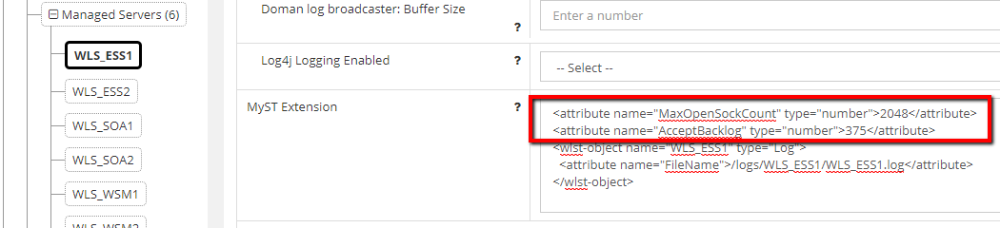
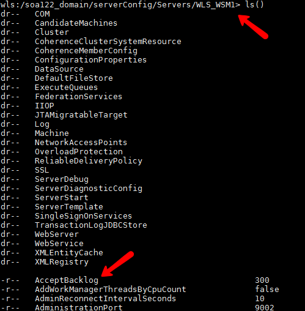

MyST provides an intuitive data model to define your Fusion Middleware model that covers most of the configuration you need to set up. However, you can extend MyST to achieve specific configuration requirements that are not available in the model.

**NOTE:** Define declarative WLST only if the MyST model does not have the configuration that you want to define. MyST must be extended only when strictly necessary. Contact [Rubicon Red Support](mailto:myst.support@rubiconred.com) if you need further information.

###Prerequisites
####Create the WLST Script
1. Easiest way to do this is using the WebLogic console recording 
1. Here is an example of a WebLogic recorded wlst script:

```python
cd('/')
cmo.createForeignJNDIProvider('MyForeignJNDIProvider')

cd('/ForeignJNDIProviders/MyForeignJNDIProvider')
set('Targets',jarray.array([ObjectName('com.bea:Name=osb_cluster,Type=Cluster')], ObjectName))
cmo.setProviderURL('t3://myserver:8001')
cmo.setInitialContextFactory('weblogic.jndi.WLInitialContextFactory')
cmo.createForeignJNDILink('MyForeignJNDILink')

cd('/ForeignJNDIProviders/MyForeignJNDIProvider/ForeignJNDILinks/MyForeignJNDILink')
cmo.setLocalJNDIName('my/localjndi')
cmo.setRemoteJNDIName('my/remotejndi')
```

####Create a MyST Workspace
1. Create a new folder for our MyST workspace.
```bash
mkdir myst-workspace
```
1. Navigate to the myst-workspace and initialize using MyST. Ensure MYST_HOME environment variable is set to your MyST home directory.
```bash
cd myst-workspace
export MYST_HOME=/opt/myst-studio; export PATH=$PATH:$MYST_HOME
myst init
```

###Generate the MyST Extension
1. Generate the myst-extension.
```
myst generate-model -Dmodel.source=wlst -Dwlst.file=/path-to-your-script/Script1487132184588.py
```
2. Follow the instructions outputted by the generate-model action.

```
------------------------------------------------------------------------
  R U B I C O N >< R E D                             
 ...delivery...deMySTified..............................................
 (c) 2011-2016 Rubicon Red Software Pty Ltd. All rights reserved
 ------------------------------------------------------------------------

 Analysing request...
 Using wlst.file property - /tmp/myst-workspace/Script1487132184588.py

 If you are using MyST CLI add the following to your MyST workspace
 <core xmlns="http://myst.rubiconred.com/core">
  <domain xmlns="">
    <myst-extension>
      <wlst-object name="MyForeignJNDIProvider" type="ForeignJNDIProviders">
        <wlst-object name="MyForeignJNDILink" type="ForeignJNDILinks">
          <attribute name="LocalJNDIName">my/localjndi</attribute>
          <attribute name="RemoteJNDIName">my/remotejndi</attribute>
        </wlst-object>
        <attribute name="Targets" type="py">jarray.array([ObjectName('com.bea:Name=osb_cluster,Type=Cluster')], ObjectName)</attribute>
        <attribute name="ProviderURL">t3://myserver:8001</attribute>
        <attribute name="InitialContextFactory">weblogic.jndi.WLInitialContextFactory</attribute>
      </wlst-object>
    </myst-extension>
  </domain>
</core>

 If you are using MyST Studio.
 1 - Navigate to your Platform Blueprint
 2 - Click on 'Edit Configuration'
 3 - Go to 'WebLogic Domains' and click on the domain
 4 - Select 'Show advanced properties' and click 'Edit'
 5 - Copy and paste the following under Myst Extension
<wlst-object name="MyForeignJNDIProvider" type="ForeignJNDIProviders">
  <wlst-object name="MyForeignJNDILink" type="ForeignJNDILinks">
    <attribute name="LocalJNDIName">my/localjndi</attribute>
    <attribute name="RemoteJNDIName">my/remotejndi</attribute>
  </wlst-object>
  <attribute name="Targets" type="py">jarray.array([ObjectName('com.bea:Name=osb_cluster,Type=Cluster')], ObjectName)</attribute>
  <attribute name="ProviderURL">t3://myserver:8001</attribute>
  <attribute name="InitialContextFactory">weblogic.jndi.WLInitialContextFactory</attribute>
</wlst-object>
 6 - Click 'Save' then 'Apply Changes'


 SUCCESS - 0 Seconds

```

###Applying the MyST Extension at in a Specific Resource
In MyST Studio if you want to add the myst-extension to a specific resource (eg. JMS Module) as opposed to the domain level you need to copy the relevant XML internal elments.

This example shows myst-extension applied at a managed server level (as opposed to the domain level).

1. Run instructions above to generate the myst-extension

```
 If you are using MyST Studio.
 1 - Navigate to your Platform Blueprint
 2 - Click on 'Edit Configuration'
 3 - Go to 'WebLogic Domains' and click on the domain
 4 - Select 'Show advanced properties' and click 'Edit'
 5 - Copy and paste the following under Myst Extension
<wlst-object name="WLS_ESS1" type="Servers">
  <attribute name="MaxOpenSockCount" type="number">2048</attribute>
  <attribute name="AcceptBacklog" type="number">375</attribute>
</wlst-object>
 6 - Click 'Save' then 'Apply Changes'
```

2. Because you are already at the server level you only need to copy elements inside of WLS_ESS1. 
3. This is visible in wlst.sh
   
