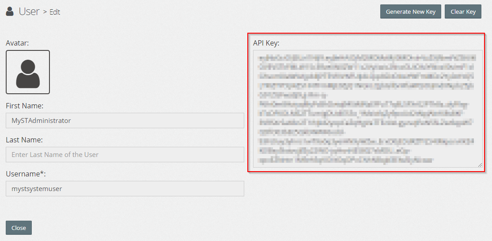

> **NOTE:** This is an advanced instruction for manipulating MyST using the REST APIs. Take a **backup** of the database before performing any direct manipulations using the API.

If you are looking to create or configure any MyST component using REST API, this guide will help you to achieve. In this guide, you would know how to use Development Tools of our Browser to get respective REST APIs MyST studio invokes to its backend service to create components. We will then make use of Jenkins (which in turn uses shell commands) to GET/POST data to MyST studio.

In this example, we explain how to create Stream types using the REST API. At a minimum you will require `curl` to be installed on your machine. To make JSON manipulation easier, it is also recommended to install `jq` which is downloadable from [here](https://stedolan.github.io/jq/download/).

## Retrieving your API key

In order to interact with API, you will first need to retrieve and/or regenerate an API key from MyST Studio. This can be performed as follows:  

1. Login to MyST Studio with an administrator account  
2. Click on "Administration" > "Users"  
3. Under the MySTAdministrator \(API User\) click on drop-down and select "Show API Key"  
     
4. Copy the key, we will use this later in our Jenkins. If you want, you can generate a new key at any time.  
   
5. In Jenkins go to Manage Jenkins > Configure System
6.  Create new Environment variables for MyST Studio Host and MyST Studio API key.
   

## Retrieving API from MyST studio

In order to POST data to MyST studio, we need URL and payload that needs to be posted which will be creating our resources. This can be performed as follows:

1. Login to MyST Studio and hover over to the component you want to create. In our example as we are creating Stream Types, we go to the Stream Types section under Release Management.
2. Open Developer Tools in your Browser (Google Chrome recommended) by pressing **F12** on your Keyboard.
3. Create a Stream Type so that we can view the API key which is being used to create Stream Type.
4. Now, as we can see there are many APIs getting called and posted. We have to select **POST** action which will have API and payload respectively.
   
5. Now, scroll down to bottom to view Request payload. Click on "**view source**" which give source payload which we can use to parameterize and use multiple types.
   
6. Save the payload and we will use it in next section.

## Jenkins Job Setup

In order to reuse the source payload to create Multiple Stream Types, we parameterize the fields which we pass when we create manually. Below steps guide the procedure:

1. Create a FreeStyle Jenkins Job with Name “Stream Type Creation”

2. Add two parameters “Name” and “Description”

3.  In the Build section add a Execute shell which will publish Stream Type Data to MyST studio using curl commands as below:

   ```
   StreamTypeData='{"name":"'${Name}'","description":"'${Description}'"}'  
   curl -k -X POST -H "Content-type:application/json" -H "Authorization: Bearer ${MYST_STUDIO_API_KEY}" -d "$StreamTypeData"  ${MYST_STUDIO_URL}/api/v1/release-management/stream-types"
   ```

   

4. Save the job

5. Click Build with Parameters and provide “Name” and “Description”.

6. The Job will post the Data to MyST Studio and Stream Type will be created successfully
   

7. Verify the resource created in MyST Studio.
   

