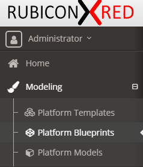

# Introspecting Oracle SOA Cloud Service (SOACS) Environment

A [SOA Cloud Service (SOACS)](https://cloud.oracle.com/en_US/soa) environment can be [introspected](https://docs.rubiconred.com/myst-studio/platform/introspection/) to create a Platform Blueprint and Platform Model.

The article will guide users through the introspection process specifically for SOACS environments.

## Infrastructure Provider

Create a Cloud Infrastructure for MyST to access the SOACS environment.

1. Hover over **Discover** and click **Cloud Services** 
2. Click **Discover** > **Cloud Infrastructure**
3. Enter a **Name** such as `Default`
4. Click 
5. Enter the **Name** and **Private Key Content** and click **Add** 
6. Click 
7. Enter the **Name**, **SSH User Name**, **Key Pair**
8. Select **Yes** for Run as different user and enter `oracle` as the **Other User Name** 
9. Click 
10. Retrieve the **Public IP** from your Oracle Cloud account 
11. Enter **Name**, **Host Name** and select **Compute Logical Definition**, **Environment**, **OS Agent Credential** 
12. Click  to validate the SSH connection is successful then click **Add**

## Discovery

1.  

## Platform Blueprint

1. Click Modeling > Platform Blueprints 
2. Select your Platform Blueprint
3. The table below shows the Platform Blueprint configuration changes to align MyST with SOACS

| Location                                                     | Property                       | MyST Value                              | SOACS Value                                     | Notes                                                        |
| ------------------------------------------------------------ | ------------------------------ | --------------------------------------- | ----------------------------------------------- | ------------------------------------------------------------ |
| WebLogic Domain Configuration > Coherence Clusters > defaultCoherenceCluster | Cluster Listen Port            | `9991`                                  | `7574`                                          | SOACS now uses `7574` while SOA on-premise was `9991`        |
| WebLogic Domain Configuration > WebLogic Deployment Targeting > Applications > wsm-pm | Targets                        | `AdminServer, soa_cluster`              | `AdminServer`                                   | Remove the `soa_cluster`  so only the AdminServer is targeted |
| WebLogic Domain Configuration > JDBC Data Sources > *All OOTB* | Test Table Name                | `SQL SELECT 1 FROM DUAL`                | `SQL ISVALID`                                   | (Optional) Set the value for each out of the box (OOTB) Data Source |
| WebLogic Domain Configuration > JDBC DataSources             | wlsbjmsrpDataSource            | N/A                                     | Name, Targets, JDNI Name, and Driver Class Name | (Optional) Only necessary if users want to change configuration for the Data Source |
| WebLogic Domain Configuration > JCA Adapters                 | Outbound Connection Properties | N/A                                     | Any properties                                  | MyST currently does not introspect Outbound Connection Properties |
| WebLogic Domain Configuration > Clusters                     | Cluster Address                | Auto computed by MyST                   | Auto computed by MyST (cannot be changed)       | (Optional) MyST computation requires the Cluster Address to always be set |
| WebLogic Domain Configuration > AdminServer > Default Store  | Directory                      | `${[rxr.wls.Domain-1].shareHome}/tlogs` |                                                 | TLOGS value to be cleared and set as empty value             |
| WebLogic Domain Configuration > Managed Servers > Default Store | Directory                      | `${[rxr.wls.Domain-1].shareHome}/tlogs` |                                                 | TLOGS value to be cleared and set as empty value             |

## Validation

#### Dry Run

After an introspection and the configuration of a Blueprint it's good practice to validate the changes against the SOACS environment. A **dry run** functionality mimics the configuration applied by MyST and outputs the changes.  

#### Check For Drift

safe optional...

## FAQ

**Question:** Does MyST support an administrative user other than the *weblogic* username?

**Answer:** No, at this point a *weblogic* username is required. Admins can create an additional *weblogic* user.