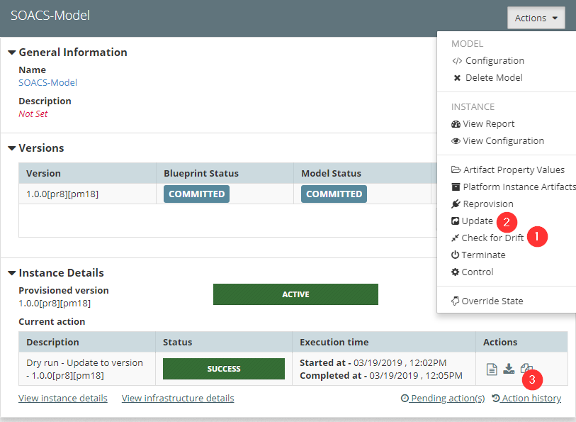

You can introspect an existing WebLogic domain directly from MyST Studio to bring it under the control of MyST. Details on how to do this are documented [here](https://docs.rubiconred.com/myst-studio/platform/introspection/).

This article covers introspecting an Oracle SOACS environment.

## Infrastructure Provider

After introspection the MyST Infrastructure Provider's hostname is configured to use a unresolvable DNS alias. Change the alias to a resolvable alias or IP address.

## Platform Blueprint

| Location                                                     | Property                       | Value / Notes                                                |
| ------------------------------------------------------------ | ------------------------------ | ------------------------------------------------------------ |
| Global Variables                                             | oracle.base                    | /u01/data                                                    |
| Global Variables                                             | myst.agent.home                | /u01/app/oracle/tools/myst                                   |
| WebLogic Domain Configuration                                | Domain Home                    | ${[rxr.wls.Fmw-1].oracleBase}/domains/${[rxr.wls.Domain-1].name} |
| WebLogic Domain Configuration                                | Admin Server Home              | ${[rxr.wls.Fmw-1].oracleBase}/domains/${[rxr.wls.Domain-1].name} |
| WebLogic Domain Configuration                                | Managed Server Home            | ${[rxr.wls.Fmw-1].oracleBase}/domains/${[rxr.wls.Domain-1].name} |
| WebLogic Domain Configuration                                | Shared Home Base               | ${[rxr.wls.Fmw-1].oracleBase}/domains/${[rxr.wls.Domain-1].name} |
| WebLogic Domain Configuration > Coherence Clusters > defaultCoherenceCluster | defaultCoherenceCluster        | 7574                                                         |
| WebLogic Domain Configuration > WebLogic Deployment Targeting > Applications > wsm-pm | Targets                        | **Note:** Remove adminserver                                 |
| WebLogic Domain Configuration > JDBC Data Sources > (Out of the Box JDBC Datasources) | Test Table Name                | SQL ISVALID                                                  |
| WebLogic Domain Configuration > JCA Adapters                 | Outbound Connection Properties | **Note:** Introspection currently does not introspect these properties |
| WebLogic Domain Configuration                                | Username                       | **Note:** MyST only supports the weblogic user. Create a weblogic administrative user if one does not exist. |
| WebLogic Domain Configuration > Clusters                     | Cluster Address                | **Note:** These addresses will need to be applied by MyST as they are auto computed. |
| WebLogic Domain Configuration > AdminServer > Default Store  | Directory                      | **Note:** This value needs to be cleared and set as empty    |
| WebLogic Domain Configuration > Managed Servers > Default Store | Directory                      | **Note:** This value needs to be cleared and set as empty    |
|                                                              |                                |                                                              |

##### Known Issues #####

 * Introspection by default has OSB and SOA clustered but in SOACS it's all in one
    * Remove the **Oracle Service Bus** from Product(s) in Compute Groups

# TODO - dtran

##### Create a Model using the Introspected Blueprint.

To create a Model using the Introspected Blueprint details on how to do this are documented [here](https://docs.rubiconred.com/myst-studio/platform/models/).

We need to update configurations in the model to match with existing environment.

 * Go to Platform Model > WebLogic Domain configuration > Machines and correct the **Name** and **Listen Address** of the all machines.

 * Update the cloud.stack.name for the model in Global Variable if changed and go to WebLogic Domain configuration replace the domain **Name** with ${var.cloud.stack.name}_domain

 * Remove the exisiting Weblogic clusters Name and provide the correct value

 * Admin server configuration changes

    * Replace the Adminserver Name with ${var.cloud.stack.name}_adminserver 
    * Click Show advanced properties 
    * Remove the External Listen Address and set the correct value and add the listen address for all the network channels
    * Remove the Arguments and enter the correct values
    * Add all the configurations which MyST introspection didn't capture

 * Managed Server configuration changes
    * Replace the Manage server Name with ${var.cloud.stack.name}_server_1
    * Remove the Arguments and enter the correct Memory argument values
    * Update the listen address, listen port and ssl port 
    * Add all the configuration which introspect didn't capture
    * Repeat the same above steps for other managed servers by incrementing the Name in first step ex: ${var.cloud.stack.name}_server_2, ${var.cloud.stack.name}_server_3.....${var.cloud.stack.name}_server_N.

 * Update all the Datasource passwords

Most of the configuration has updated to match with the existing SOACS environment and now you should verify the configuration 
 * Go to Platform Models >  SOACS model(your model) > Actions and click **Provision** and select the **Environment already pre-provisioned?** and Click **finish**.

   

 * Now click the **Check for Drift** in the Actions and which results the configuration differences between the Platform Model and SOACS environment

   

 * Correct the configuration in the Platform Model as per the results if any and Click **Update** in the Actions by selecting the **dry run**.

 * Once all the configuration matches with existing environment and now Click **Update** in the Actions.