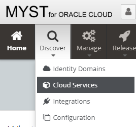
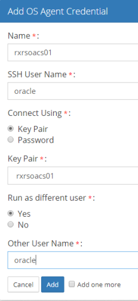
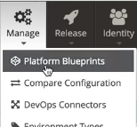

# Introspecting Oracle SOA Cloud Service (SOA CS) Environment

A [SOA Cloud Service (SOA CS)](https://cloud.oracle.com/en_US/soa) environment can be [introspected](https://userguide.mystsoftware.com/platform/introspection/) to create a Platform Blueprint and Platform Model.

The article will guide users through the introspection process specifically for SOA CS environments.

## Infrastructure Provider

Create a Cloud Infrastructure for MyST to access the SOA CS environment.

1. Hover over **Discover** and click **Cloud Services** 
2. Click **Discover** > **Cloud Infrastructure**
3. Enter a **Name** such as `Default`
4. Click 
5. Enter the **Name** and **Private Key Content** and click  
6. Click 
7. Enter the **Name**, **SSH User Name**, **Key Pair**
8. Select **Yes** for Run as different user and enter `oracle` as the **Other User Name** 
9. Click 
10. Retrieve the **Public IP** from your Oracle Cloud account 
11. Enter **Name**, **Host Name** and select **Compute Logical Definition**, **Environment**, **OS Agent Credential** 
12. Click  to validate the SSH connection is successful then click 
13. Click 

## Discovery

The discovery process reads the SOA CS environment into MyST.

1. Hover over **Discover** and click **Cloud Services** 
2. Click **Discover** > **Soa Cloud Service**
3. Enter a **Name** and click  
4. Enter the **Domain home directory**, **Platform Model**, and **Password** and click **Discover** 
5. After the discovery finishes loading click 
6. Review your instance definition and click 

## Blueprint

1. Click Manage > Platform Blueprints 
2. Select the SOA 12.2.1.2 Blueprint
3. Below are the Blueprint configuration changes to align MyST with SOA CS

| Location                                                     | Property                       | MyST Value                              | SOA CS Value                                                 | Notes                                                        |
| ------------------------------------------------------------ | ------------------------------ | --------------------------------------- | ------------------------------------------------------------ | ------------------------------------------------------------ |
| WebLogic Domain Configuration > Coherence Clusters > defaultCoherenceCluster | Cluster Listen Port            | `9991`                                  | `7574`                                                       | SOACS uses `7574` while SOA on-premise was `9991`            |
| WebLogic Domain Configuration > WebLogic Deployment Targeting > Applications > wsm-pm | Targets                        | `AdminServer, soa_cluster`              | `AdminServer`                                                | (Optional) Remove the `soa_cluster`  so only the AdminServer is targeted |
| WebLogic Domain Configuration > JDBC Data Sources > *All OOTB* | Test Table Name                | `SQL SELECT 1 FROM DUAL`                | `SQL ISVALID`                                                | (Optional) Set the value for each out of the box (OOTB) Data Source |
| WebLogic Domain Configuration > JDBC DataSources             | wlsbjmsrpDataSource            | N/A                                     | Name, Targets, JDNI Name, and Driver Class Name              | (Optional) Only necessary if users want to change configuration for wlsbjmsrpDataSource |
| WebLogic Domain Configuration > JCA Adapters                 | Outbound Connection Properties | N/A                                     | Any properties                                               | MyST currently does not introspect Outbound Connection Properties. Add if you have any JCA Adapters configured. |
| WebLogic Domain Configuration > Clusters                     | Cluster Address                | Auto computed by MyST                   | Auto computed by MyST (cannot be removed)                    | (Optional) MyST computation requires the Cluster Address to always be set |
| WebLogic Domain Configuration > **AdminServer** > Default Store | Directory                      | `${[rxr.wls.Domain-1].shareHome}/tlogs` | `${[rxr.wls.Domain-1].domainAserverHome}/servers/${[rxr.wls.AdminServer-1].name}/data/store/default` | By default TLOGS are not defined in the WLS Console. In MyST we set them to their default directory. |
| WebLogic Domain Configuration > **Managed Servers** > Default Store | Directory                      | `${[rxr.wls.Domain-1].shareHome}/tlogs` | `${[rxr.wls.Domain-1].domainAserverHome}/servers/${[rxr.wls.ManagedServer-1].name}/data/store/default` | By default TLOGS are not defined in the WLS Console. In MyST we set them to their default directory. |

## Validation

#### Dry Run

After the discovery and configuration of a Blueprint it is good practice to validate the changes against the SOA CS environment. A **dry run** functionality mimics the configuration applied by MyST and outputs the changes. Below is an example of changes to the **Cluster Address** and a **JDBC Datasource**. 

#### Check For Drift

MyST has a **check for drift** function to compare the current MyST Platform Instance against the SOACS environment. 

Below are safe and optional properties/values which can be used as MyST defaults in the Blueprint. They are the *optional* properties taken from the table above in the **Blueprint** section.

| Location                                                     | Property                       | MyST Value                              | SOACS Value                                                  |
| ------------------------------------------------------------ | ------------------------------ | --------------------------------------- | ------------------------------------------------------------ |
| WebLogic Domain Configuration > WebLogic Deployment Targeting > Applications > wsm-pm | Targets                        | `AdminServer, soa_cluster`              | `AdminServer`                                                |
| WebLogic Domain Configuration > JDBC Data Sources > *All OOTB* | Test Table Name                | `SQL SELECT 1 FROM DUAL`                | `SQL ISVALID`                                                |
| WebLogic Domain Configuration > JDBC DataSources             | wlsbjmsrpDataSource            | N/A                                     | Name, Targets, JDNI Name, and Driver Class Name              |
| WebLogic Domain Configuration > Clusters                     | Cluster Address                | Auto computed by MyST                   | Auto computed by MyST (cannot be removed)                    |

## FAQ

**Question:** Does MyST support an administrative user other than the *weblogic* username?

**Answer:** No, at this point a *weblogic* username is required. Admins can create an additional *weblogic* user.