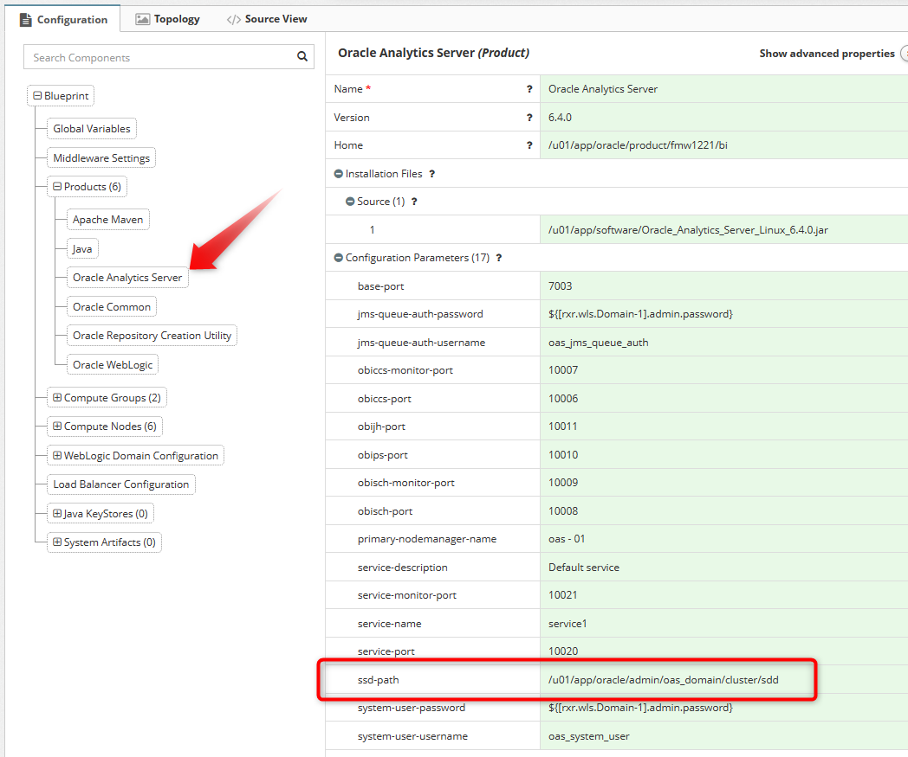
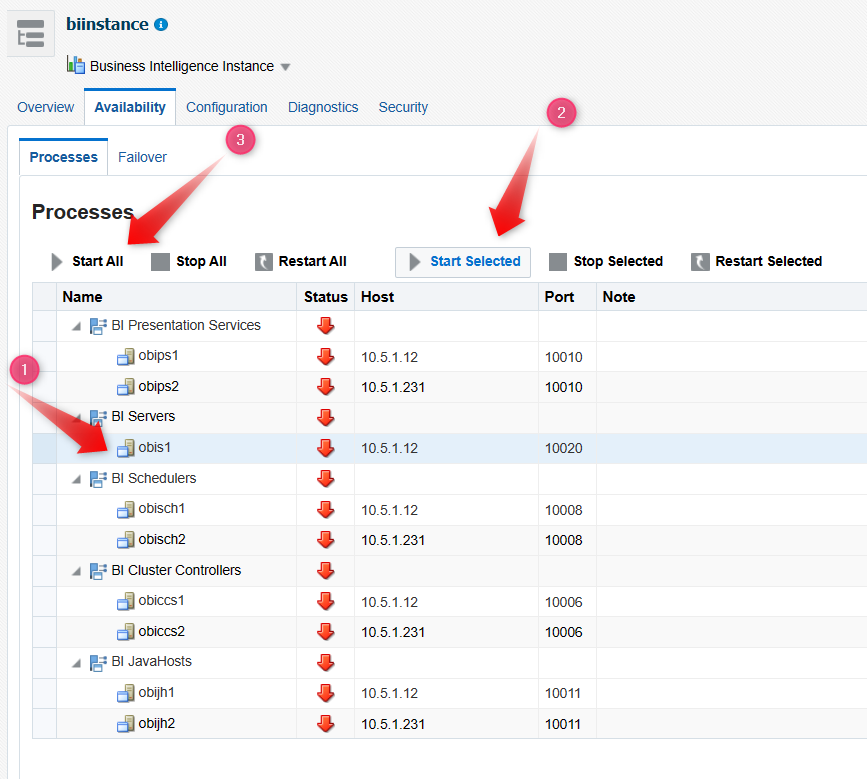

Myst supports Oracle Analytics Server (OAS) 6.4.0 in Myst [7.1.0-rc1](https://www.mystsoftware.com/post/myst-studio-7-1-0-rc1).

# Prerequisites

#### Operating System Configuration
Ensure your host meets requirements as per [Oracle documentation](https://docs.oracle.com/en/middleware/bi/analytics-server/enterprise-deploy-oas/preparing-kubernetes-host-computers-enterprise-deployment.html#GUID-8EF36C74-05C9-49A2-876E-9019893EDB5C). Particularly the Linux operating system kernel, file limits, and process limits. If these are not configured to minimum specification you may find the **JVMs very slow**.

#### Naming Convention
Due to some config errors when creating System Components in OAS it is recommended to use the default AdminServer and Managed Server names (`AdminServer`, `bi_server1`, `bi_server2`, etc).

#### Shared Storage
OAS uses a Singleton Data Directory (SDD) for sharing data and config across multiple nodes. This directory needs to be accessible by all nodes as per [Oracle documentation](https://docs.oracle.com/en/middleware/bi/analytics-server/enterprise-deploy-oas/creating-initial-bi-domain-enterprise-deployment.html#GUID-4D425BF9-F68B-474A-B789-2A3FAC3573B6).

Myst will assume this directory is shared and accessible to all nodes.

#### Credentials
OAS's **system.user** account is used by OAS internally as per [Oracle documentation](https://docs.oracle.com/en/middleware/bi/analytics-server/enterprise-deploy-oas/creating-initial-bi-domain-enterprise-deployment.html#GUID-2CCBB193-6854-4588-B102-B209D4ABE55E).

Myst automatically creates the user as part of domain creation.

OAS's **jms.queue.auth** account must be a unique name and apart of the `Administrators` group as per [Oracle documentation](https://docs.oracle.com/en/middleware/bi/analytics-server/enterprise-deploy-oas/creating-initial-bi-domain-enterprise-deployment.html#GUID-2CCBB193-6854-4588-B102-B209D4ABE55E). Change the myst default naming (if you'd like).

Myst automatically creates the user and assigns to the `Administrators` group.

# Provisioning

After provisioning completes you must start the system components via the **Enterprise Manager** console.

You can immediately click the **Start All** button however, we find starting the **BI Service Instance** (`obis1`) first avoids a race condition resulting in the failure of one or more system components.

