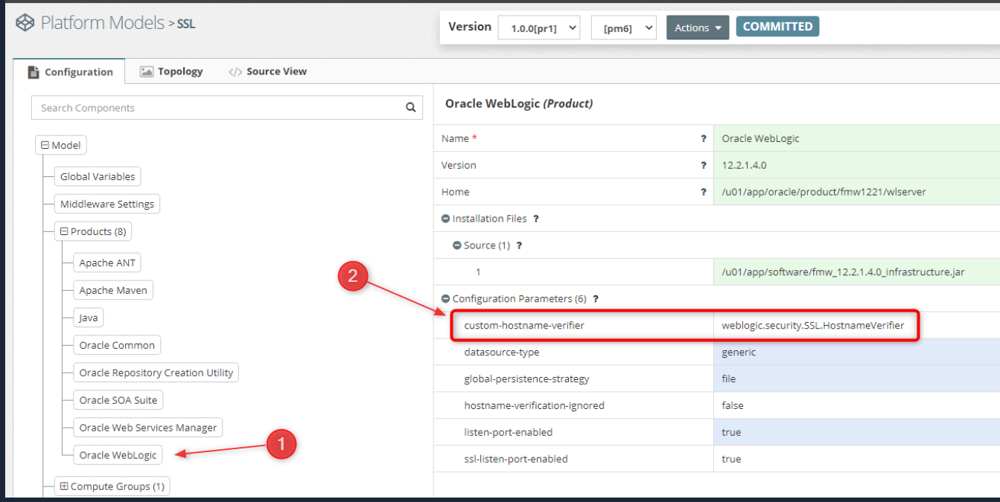

This page lists product parameters used to customize SOA, OSB, WebLogic, and other products.

## Usage Example

## Supported Parameters

*Note: This table is constantly updated*

| Product  | Parameter                       | Values      | Description                                                  |
| -------- | ------------------------------- | ----------- | ------------------------------------------------------------ |
| WebLogic | `hostname-verification-ignored` | true\|false | All Weblogic servers (Admin, Managed) will have SSL hostname verification as `BEAHostnameVerifier` |
| WebLogic | `custom-hostname-verifier`      | string      | All Weblogic servers (Admin, Managed) will have SSL hostname verification as `CustomHostnameVerifier`  All Weblogic servers (Admin, Managed) will have [class.name](http://class.name/) as the custom hostname verifier |
|          |                                 |             | More coming soon...                                          |

