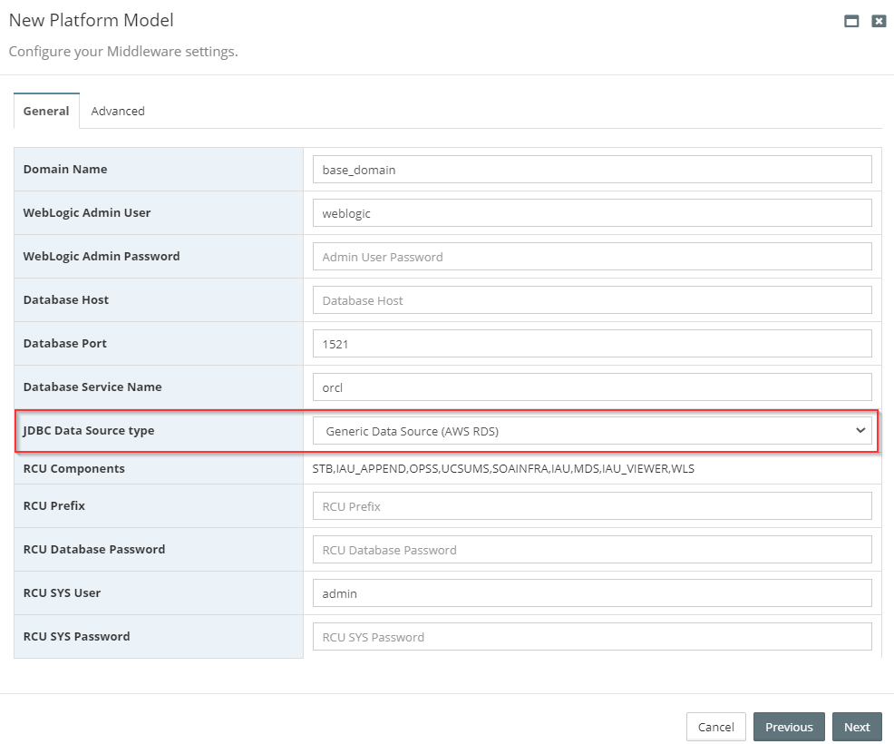
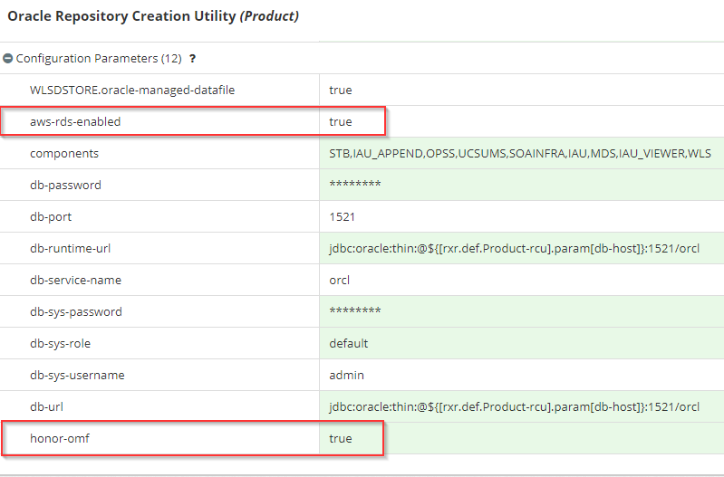

If Oracle DB with OMF enabled, we can't use RCU out of the box and RCU in 12.1.3 doesn't support the honorOMF flag

Amazon RDS only comes with honorOMF enabled and Process would normally be to create the sql scripts, pass to a db to change and execute, then get back

With Myst this process is **fully automated**; from script creation, to script update, and script execution What Myst does under the covers:

1. generate RCU script
2. make the necessary adjustments to RCU schemas to be OMF compliant
3. execute the schema/system load script
4. execute the data load script
5. continue with provisioning execution

Myst now supports SOA/OSB/ESS 12.1.3 provisioning (RCU) on Amazon RDS databases.

### Understanding the RDS RCU Properties

#### Platform Blueprint

If using database persistence, remember to adjust where your DB persistence store is located
 set WLSDSTORE.oracle-managed-datafile=true

1. Navigate to the Platform Blueprint which you want to change in MyST Studio \(**Modeling** &gt; **Platform Blueprints**\)
2. Click **Edit Configuration** 
3. Click **Product**>**Oracle Repository Creation Utility**
4. Click **+** in Configuration Parameters and add **WLSDSTORE.oracle-managed-datafile** as key and  **true** as value
5. Click **Save & Commit** 

#### Platform Model

During creation of the platform model in FUSION MIDDLEWARE CONFIGURATION section select the **JDBC Data Source type** as **Generic Data Source (AWS RDS)** 

Provide all the required details and finish the creation of model

After creation of the model now you can see the properties **aws-rds-enabled** and **honor-omf** was set to true

1. Navigate to the Platform Model which you want to change in MyST Studio \(**Modeling** **&gt; Platform Models>View configuration**\)
2. Click **Product**>**Oracle Repository Creation Utility**

