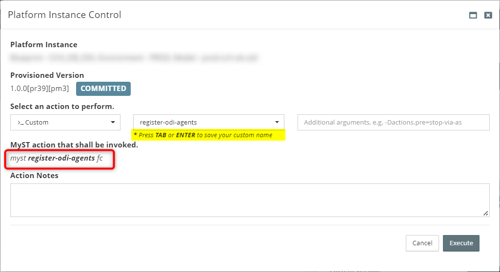
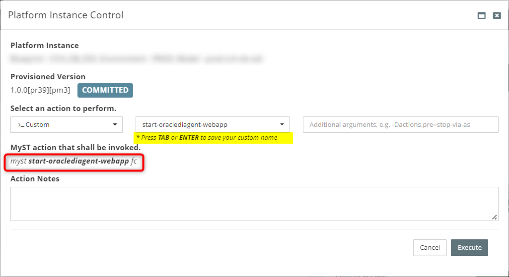
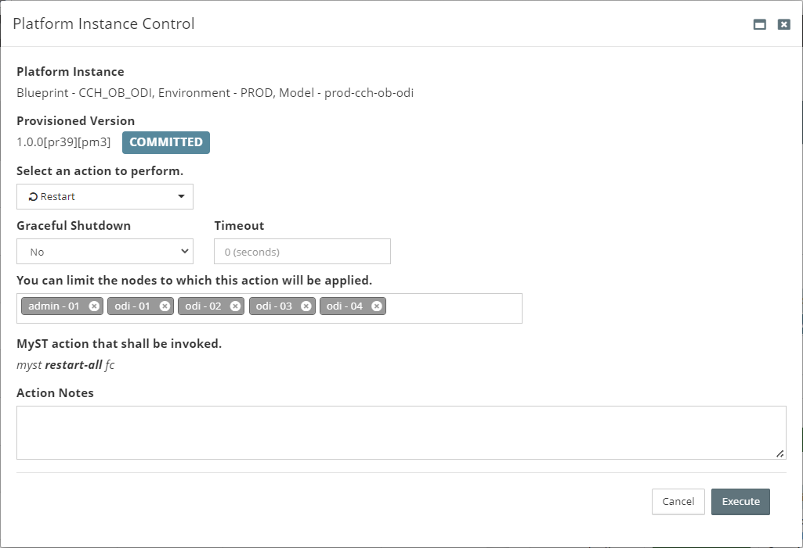

## Provisioning Oracle Data Integrator 12c
### Assumptions
#### Enterprise Install with J2EE Agent
Oracle Data Integrator 12.2.1.2.6 is an enterprise install with a J2EE agent.

#### ODI Agent Name
1. The ODI agent is named OracleDIAgent and doesn't need to be changed.
2. Changing the name of this agent requires ODI Studio > Creating a domain template containing the new agent name > unpacking the domain template

### Installation
#### Overview
1. Provision using Myst
3. Run a Myst custom action to create an Agent in the Master Repository or; alternatively, create the Agent manually using ODI Studio/ODI Console
4. Start the ODI app
5. Restart the ODI managed servers

### Create an Agent using Myst
Register the ODI agent by doing the following after provisioning the ODI domain:
1. Platform Model > Actions > Control > Custom > `register-odi-agents`
2. Click **Execute**

### Start the ODI Application
When registration is complete, start the ODI application:
1. Platform Model > Actions > Control > Custom > `**start-oraclediagent-webapp**`
2. Click **Execute**

### Restart the ODI Managed Servers
When registration and the ODI application has started, restart theODI Managed Servers:
1. Platform Model > Actions > Control > Custom > **Restart**
2. Click **Execute**
  

## Alternative to Using Myst
### Manually Create an Agent with ODI Console
#### ODI Console (Web Browser)
1. Access the ODI Console on `http://<HOST>:15101/odiconsole`
2. Select Master Repository and log in with an administrative user such as `SUPERVISOR` 
3. Go to **Topology** > **Physical Architecture**
4. Right click on **Agents** and click **Create**   
5. Enter the following details to add the physical agent:
  `Name: OracleDIAgent`
  `Host: <HOST>`
  `Port: <PORT>`
   **NOTE**: Use a load balanced URL for `<HOST>` if the environment is highly available

#### Starting the ODI Agent
1. In the WebLogic Administration console select Deployments. Navigate through the table of deployments until `oraclediagent` is visible.
  
2. If the state of the application is shown as Failed, select the Control tab on the Deployments screen.
3. Select the checkbox for the `oraclediagent` application, then from the Start drop-down at the bottom of the table Start Servicing all requests.
  

#### Validation
1. In the ODI Console right click and Refresh to display the newly created agent.
2. Right click and Test Connection the OracleDIAgent   
2. A successful connection message will display   
3. Go to the Enterprise Manager console to ensure the ODI target appears. 

### Create an Agent with ODI Studio
As an alternative to using the ODI Console you can follow Oracle's documentation to create an agent using ODI Studio:
https://docs.oracle.com/middleware/12212/lcm/ODING/GUID-3F74BFAB-99E9-4060-86E8-F70A8352A701.htm#GUID-6EEED355-F944-447F-A4CE-EA7BD9FE160C