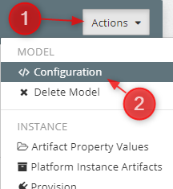
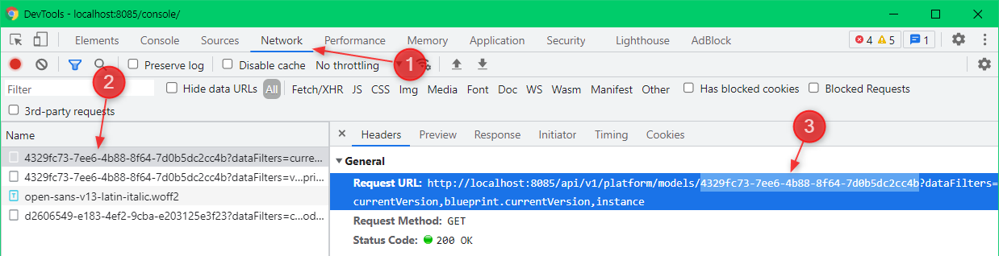
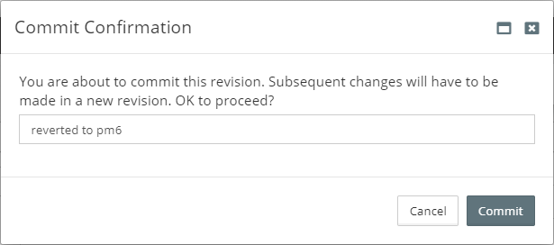

If there is an error opening the Blueprint or Model then it has been corrupted by invalid data. This guide explains how to revert to a previous revision.

## Reverting to a Previous Revision

The word **Model** and **Blueprint** can be  interchangable depending on which is corrupted.

1. Go to **Modeling** > **Platform Models**
2. Take note of the **Latest version** column for your Model 
    
3. Open the browser's Developer Tools (normally `F12` on the keyboard) to identify the **Model ID**
4. Click your **Platform Model** > **Actions** > **Configuration** 
    
5. Click the Network tab and then the ID and then copy the **Model ID** 
 
6. Replace the variables of the URL:
   https://`<MYST_HOST>`/console/#/platform-models/`<MODEL_ID>`/`<MODEL_VERSION>`-1?revisionNumber=`<MODEL_REVISION>`
7. An example of the URL after replacing the variables:
   https://**myst.internal**/console/#/platform-models/**4329fc73-7ee6-4b88-8f64-7d0b5dc2cc4b**/**1.0.0**-1?revisionNumber=**6**
8. Paste the URL into your browser
9. Click 
10. Click 
11. Enter a meaningful commit message 
     
12. Click 
13. You have successfully reverted your Platform Model to a previous revision

A description of the variables to be replaced.

| Name           | Description                                                  |
| -------------- | ------------------------------------------------------------ |
| MYST_HOST      | Your myst hostname                                           |
| MODEL_ID       | Unique ID of the Platform Model taken from Developer Tools   |
| MODEL_VERSION  | The version taken from `1.0.0[pr4][pm7]` (eg. **1.0.0**)     |
| MODEL_REVISION | **IMPORTANT:** Minus one from the revision taken from `1.0.0[pr4][pm7]` (eg. 7-1=**6**)   You want to go back a revision as 7 will be corrupted. |

## Solution

We have a pending internal ticket `FC-6556` which will significantly improve the user experience for reverting revisions of corrupted Platform Models and Blueprints.

Keep an eye on https://www.mystsoftware.com/resources/releases for the improvement.

