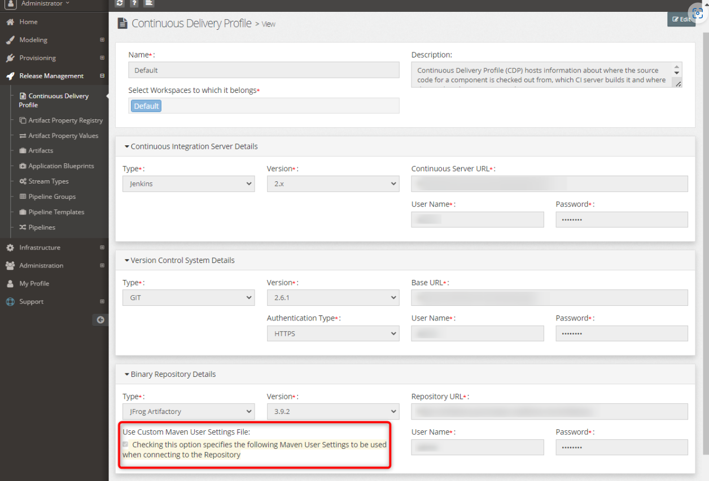

# Symptoms
When running a Maven build the logs show a `maven-default-http-blocker` error.
```
[ERROR] Failed to execute goal org.apache.maven.plugins:maven-dependency-plugin:2.5.1:copy (copy-artifacts) on project myst-Artefacts: Unable to resolve artifact.: Could not transfer artifact mystsoftware:StockOSB:sbar:1.0-101 from/to maven-default-http-blocker (http://0.0.0.0/): Blocked mirror for repositories: [artifactory-repo (http://10.0.0.1:8083/artifactory/libs-release, default, releases+snapshots), artifactory-snapshot-repo (http://10.0.0.1:8083/artifactory/libs-snapshot, default, releases+snapshots)]
```


# Cause
Version `3.8.1` of Maven blocks unsecure **http** by default.
[https://maven.apache.org/docs/3.8.1/release-notes.html#cve-2021-26291](https://maven.apache.org/docs/3.8.1/release-notes.html#how-to-fix-when-i-get-a-http-repository-blocked)

If a WebLogic patch such as the one below was applied then Maven has been updated.
[34298772 -WLS PATCH SET UPDATE 12.2.1.3.220620](https://support.oracle.com/epmos/faces/ui/patch/PatchDetail.jspx?parent=DOCUMENT&sourceId=2806740.2&patchId=34298772)


# Solution
The same Maven link above also contains a solution
[https://maven.apache.org/docs/3.8.1/release-notes.html#how-to-fix-when-i-get-a-http-repository-blocked](https://maven.apache.org/docs/3.8.1/release-notes.html#how-to-fix-when-i-get-a-http-repository-blocked)

1. Update the endpoint that is being blocked to HTTPS
2. Define a [mirror](https://maven.apache.org/guides/mini/guide-mirror-settings.html) by updating your `~/.m2/settings.xml` or Myst **Continuous Delivery Profile**.
	1. If you don't use the Continuous Delivery Profile then update `~/.m2/settings.xml` on each of the AdminServer hosts
	2. If you use the Continuous Delivery Profile then update there.<br> 
	   

*NOTE:
- Take caution when changing the Myst Continuous Delivery Profile. You will need to know what the original contents were as Myst hides it contains passwords.*
- Backup the Myst database
- You can also find the `settings.xml` when running a Myst action and SSH'ing to the AdminServer under the default Myst workspace location (``/tmp/mystWorkspace/RANDOM_ID`/resources/maven/settings.xml)

# Workaround
If neither of the above solutions work for you then there's a way to override the `maven-default-http-blocker` to block an unused/dummy protocol.

Keep in mind the `<blocked>true</blocked>` doesn't seem to do anything even when set to `false`.
```xml
    <mirrors>
      <mirror>
        <id>maven-default-http-blocker</id>
        <mirrorOf>external:dummy:*</mirrorOf>
        <name>Dummy protocol to prevent http being blocked</name>
        <url>http://0.0.0.0/</url>
        <blocked>true</blocked>
      </mirror>
    </mirrors>
```
