As part of the Enterprise Deployment Guide (EDG) Oracle recommend using a virtual IP (VIP) for the admin server. This article explains the steps to setup a VIP and failover the admin server (collocated).

There is no need to create a new compute node for the admin server. Compute nodes in MyST are represented as physical servers.

# Assumptions

* Two physical servers
  * Physical1 - Managed Server1 + Admin Server (collocated)
  * Physical2 - Managed Server2
* Failover between existing nodes in the domain
* Shared storage for aserver domain home

# 6.5.0-rc8 or Newer
## Setup Admin Server with a VIP

Start by setting the **machine** listen address which MyST references for the **AdminServer** listen address.

1. Override the AdminServer Machine name to be a generic name. Eg. 'admin'. 
   *TIP:* This can be done in the Platform Blueprint. If environments are already provisioned then you may want to control the rollout in the Platform Model instead. 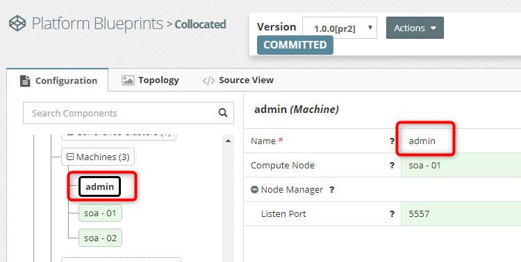
2. Use a VIP for the admin server machine's listen address 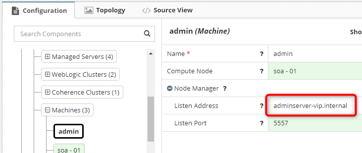

## Failing Over the Admin Server

In order to failover the Adminserver you will need to move the Admin Server product within the Compute Nodes. 

#### Update the AdminServer Product in Compute Nodes

1. Go to Platform Model > **Compute Nodes**
2. Update the **Admin Server** product to it's respective node. In this example we move the Admin Server from soa - 01 to soa - 02.
   3. Delete **Admin Server** from soa - 01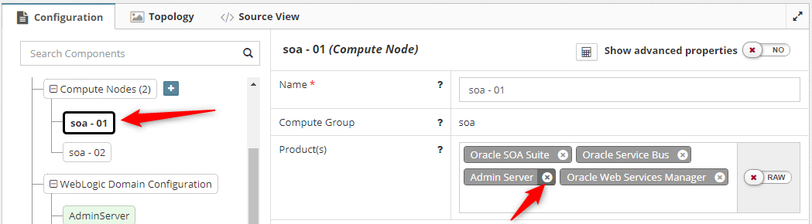 
   2. Add into soa - 02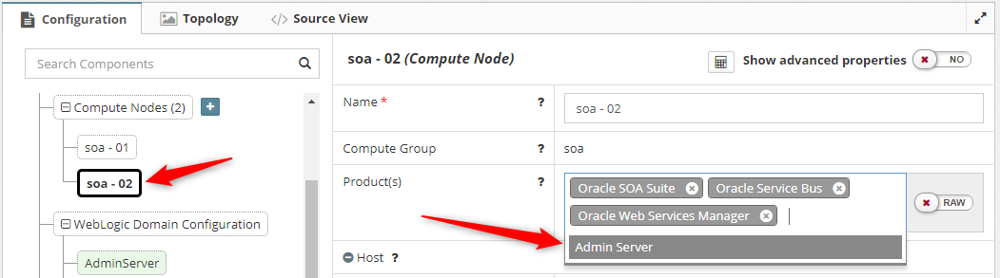 
3. Click 
4. Click Actions > **Update**
5. Stop the Admin Server (Custom action: `stop-as-via-nm`)
6. Stop the Node Managers (Custom action: `stop-nm`)
7. Update the DNS for adminserver-vip.internal to point to the new IP address
8. Start the Node Managers (Custom action: `start-nm`)
9. Start the Admin Server (Custom action: `start-as-via-nm`)
10. The Admin Server will now be successfully running on soa - 01.

# 6.5.0-rc7 or Older

Moving the Admin Server product in older versions of MyST caused invalid auto computed properties to be generated. Upgrade to 6.5.0-rc8+ for an improved experience.

## Setup Admin Server with a VIP
MyST uses the admin server machine's listen address to also set the admin server listen address. Here we set the machine listen address.

1. Use a VIP for the admin server machine's listen address
   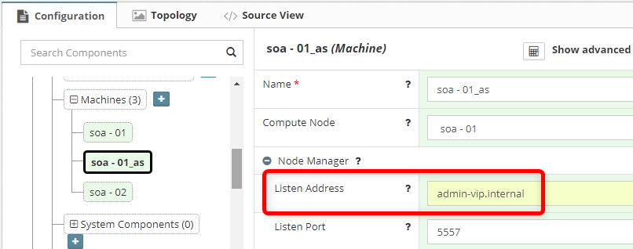

## Failing Over the Admin Server

Configuration change sin MyST are required to fail over the admin server to another node in the domain. 

#### Updating Compute Nodes

1. Go to **Compute Nodes**
2. Update the **Admin Server** product to it's respective node. For example:
  1. Delete from node 1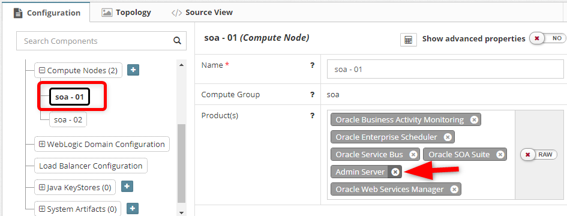
  2. Add into node 2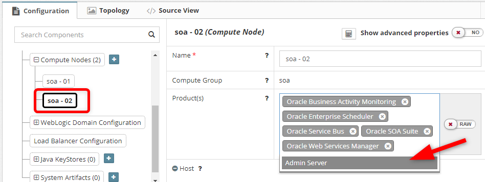
3. Click  to refresh the data in MyST
4. Go to **Machines**
5. Remove the auto-computed machine
   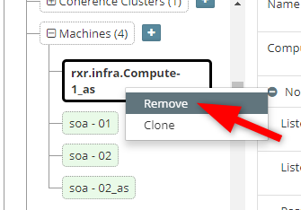
6. Restore the **Name** and **Listen Address**. This was re-computed by MyST when updating the Admin Server product.
    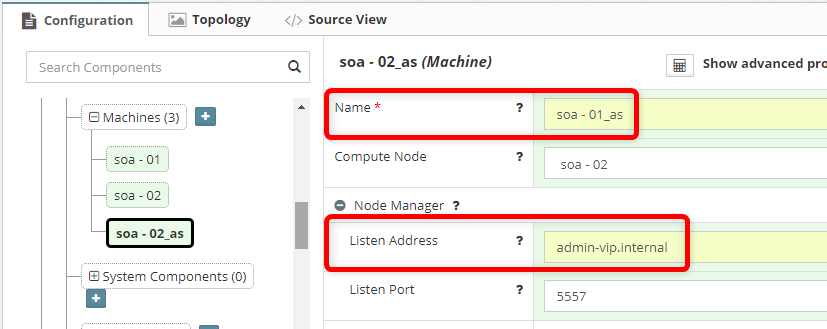
7. Click 

#### Updating the Platform Instance Revision

Force MyST to update the platform model [pmNN] revision (which contains the above compute node changes) you can use the reprovision option while selecting 'Environment already pre-provisioned' checkbox.

1. Go to Actions > **Reprovision**
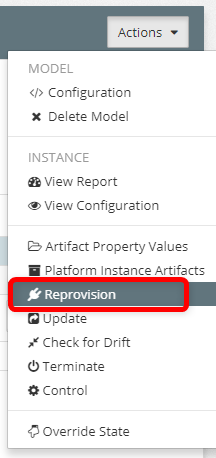
2. Select **Environment already pre-provisioned?**
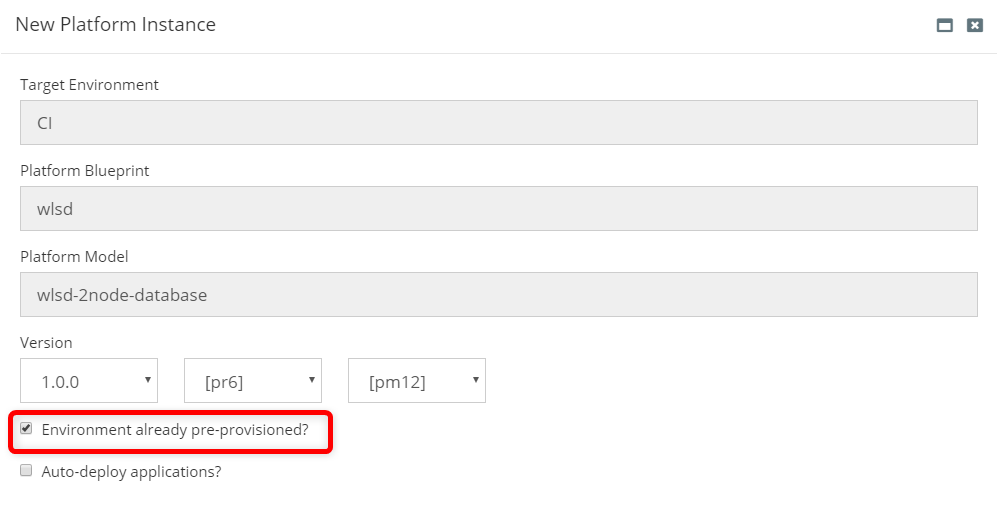
3. Click 

# MyST Actions

The MyST actions are expected to work as normal. No changes are required.

##### Patch

* MyST runs patch action against each compute node

##### Install

* Product binaries are installed to each compute node

##### Update

* The update action connects to the admin server's listen address (VIP) using WLST