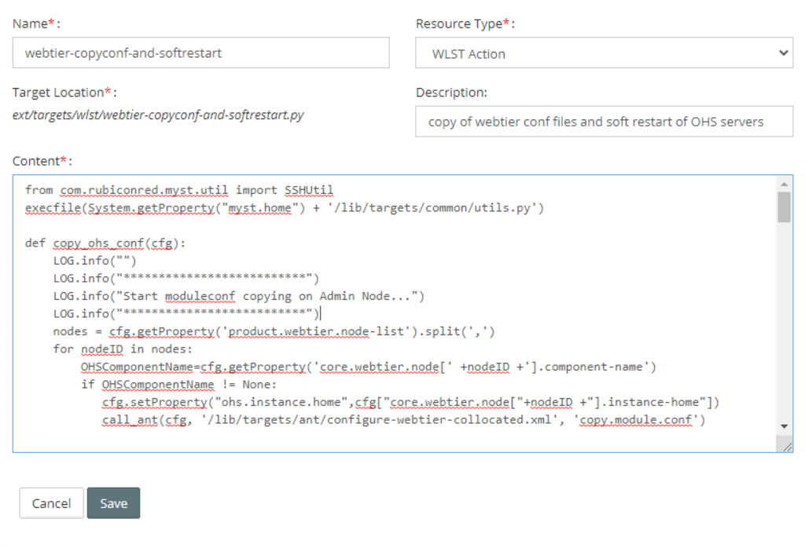

MyST has out of the box support for customising webtier routing rules and standard settings for  Registering our Webtier Template in MyST Studio and Updating our Platform Blueprint to use the Webtier template [click here](https://help.mystsoftware.com/platform-configuration/advanced#myst-webtier-template-a-working-example).To apply the changes we need to perform the restart of all servers which will cause the down time and this documentation helps to perform copyinf of the custom webtier configuration and soft/rolling restart 

1. Click **Administration** > **Custom Actions** > **Create New**

2. Fill in the mandatory/optional fields. Be sure to choose `WLST Action` for the **Resource Type**

3. Copy the below code into Content

   


###### webtier-copyconf-and-softrestart

```
from com.rubiconred.myst.util import SSHUtil
execfile(System.getProperty("myst.home") + '/lib/targets/common/utils.py')

def copy_ohs_conf(cfg):
    LOG.info("")
    LOG.info("**************************")
    LOG.info("Start moduleconf copying on Admin Node...")
    LOG.info("**************************")
    nodes = cfg.getProperty('product.webtier.node-list').split(',')
    for nodeID in nodes:
        OHSComponentName=cfg.getProperty('core.webtier.node[' +nodeID +'].component-name')
        if OHSComponentName != None:
           cfg.setProperty("ohs.instance.home",cfg["core.webtier.node["+nodeID +"].instance-home"])
           call_ant(cfg, '/lib/targets/ant/configure-webtier-collocated.xml', 'copy.module.conf')


def softrestart_ohs(cfg):
    connect(cfg.getProperty('core.fmw.admin.username'), cfg.getProperty('core.fmw.admin.password'), cfg.getProperty('admin.url'))
    LOG.info('Connected to weblogic server: ' + cfg.getProperty('admin.url'))
    systemComponents = cfg.getProperty('system-components')
    domainRuntime()

    # System Components
    if systemComponents is not None:
        sysCompList = systemComponents.split(',')
        LOG.info("MYST: Found components: " + str(sysCompList))
        for sysComp in sysCompList:
            component_name=cfg.getProperty('core.domain.system-component[' + sysComp + '].name')
            if component_name is None:
                raise('The component cannot be found. Check core.domain.system-component[' + sysComp + '].name exists.')

            # start if component is shutdown otherwise perform a softRestart()
            status = get_system_component_status(component_name)
            try:
                if status == 'SHUTDOWN' or status == 'FAILED':
                    start(component_name, 'SystemComponent')
                else:
                    softRestart(component_name)
                    java.lang.Thread.sleep(5000)
            except Exception:
                dumpStack()
                LOG.error('MYST: Failed starting system component: ' + component_name)

    ready=false
    seconds = 0

    # Handling timeouts
    while not ready:
        if seconds > int(cfg['timeout']):
            disconnect()
            raise Exception("Timeout waiting for Webtier components to start")
        ready = true
        if systemComponents is not None:
            for sysComp in sysCompList:
                component_name = cfg.getProperty('core.domain.system-component[' + sysComp + '].name')
                status = get_system_component_status(component_name)
                check_for_failure(status,component_name)
                if status != 'RUNNING':
                    ready = false
        java.lang.Thread.sleep(1000)
        seconds = seconds + 1
    disconnect()
    LOG.info('MYST: Webtier components soft restarted.')


def check_for_failure(status,component_name):
    if status == "FAILED_NOT_RESTARTABLE" or status == "FAILED":
        LOG.info("MYST: Failed to start " + component_name)
        LOG.info("MYST: " + component_name + ":" + status)
        raise("\nMYST: Aborting... Check OFMW logs for errors.")
    return 0


def get_system_component_status(component_name):
  cd('/SystemComponentLifeCycleRuntimes/' + component_name)
  return cmo.getState()


def myst(cfg):
    """Rolling 'softrestart' Webtier Components"""
    ###
    # Description
    ###
    # Rolling soft restart (equivalent of apache reload) the webtier component or;
    # Starts webtier components that were SHUTDOWN or FAILED.

    nodes = cfg.getProperty('product.webtier.node-list').split(',')
    if nodes is None:
        return

    # Timeout because softrestart should only take a second to complete
    if not 'timeout' in cfg:
        cfg['timeout']='60'

    # Copy any virtualhost conf files from myst moduleconf
    #copy_ohs_conf(cfg)

    # Soft restart
    for nodeID in nodes:
        OHSComponentName=cfg.getProperty('core.webtier.node[' +nodeID +'].component-name')
        if OHSComponentName==None:
           copy_ohs_conf(cfg)  
        else:
            LOG.info("**************************")
            LOG.info("Start moduleconf copying on: " + nodeID)
            LOG.info("**************************")
            PathToOHSComponentName=concatDir('config/fmwconfig/components/OHS/instances',str(OHSComponentName))
            PathModuleconf=concatDir(PathToOHSComponentName,'moduleconf')
            fileLocation=concatDir(cfg.getProperty('core.fmw.domain-aserver-home'),'/config/fmwconfig/components/OHS/OHS_1/moduleconf/custom.conf')
            fileDestDir=concatDir(cfg.getProperty('core.fmw.domain-mserver-home'),PathModuleconf)
            SSHUtil.copyFileToNode(nodeID, fileLocation, fileDestDir, 1)
    softrestart_ohs(cfg)

```
4. Click Save
5. Run the `webtier-copyconf-and-softrestart`custom action on platform model

